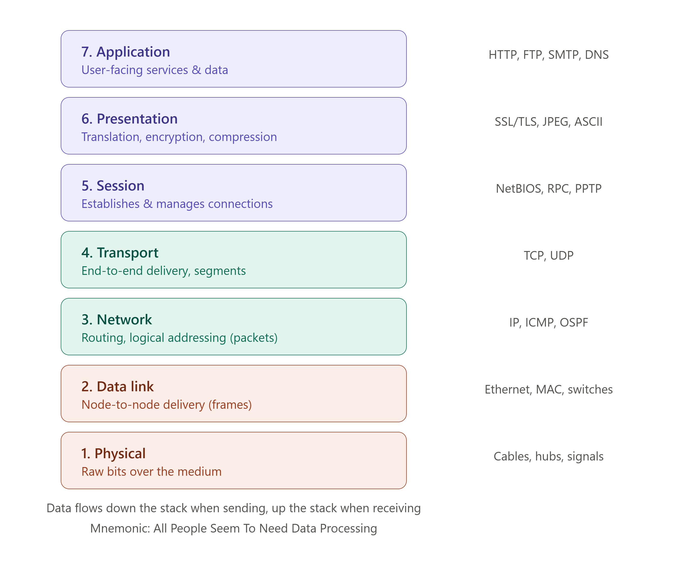

# 🌐 Introduction to Computer Networks & The OSI Model

> A **Computer Network** is a collection of interconnected devices (computers, servers, routers, phones) that can communicate and share resources such as data, files, and internet access with each other.

---

## 🎯 Why Do We Need Computer Networks?

🔴 A standalone computer can't share files, printers, or internet access with others

🔴 Without networking, businesses couldn't run emails, websites, or cloud services

🔴 Devices need a common, structured way to talk to each other — even if built by different companies

### Example

```text
Without a Network                  | With a Network
-------------------------------------------------------------
Files copied via USB drive          | Files shared instantly over LAN
Each PC needs its own printer       | One shared network printer
No internet access                  | Internet access for all devices
Isolated computers                  | Connected, collaborative systems
```

---

## 🧩 What Is a Computer Network Used For?

```text
✔ Resource Sharing      → Printers, files, storage shared across devices
✔ Communication         → Email, messaging, video calls, VoIP
✔ Data Access           → Centralized databases, cloud storage
✔ Internet Access       → Connecting to the web via ISPs
✔ Distributed Computing → Multiple systems working together (e.g., cloud computing)
✔ Reliability            → Data can be backed up across multiple connected systems
```

---

# 🧠 The Building Blocks of a Network

```text
Computer Network
 ↓
 ├── Nodes        → Devices connected to the network (PCs, servers, printers)
 ├── Links         → Physical/wireless medium connecting nodes (cables, Wi-Fi)
 ├── Protocols      → Rules that govern communication (TCP/IP, HTTP)
 └── Network Devices → Hardware that manages traffic (routers, switches, hubs)
```

---

# 1️⃣ Types of Networks (By Scale)

### Definition

> Networks are classified by the geographical area they cover — from a single room to the entire globe.

| Type | Full Form | Coverage Area | Example |
| ------ | ------------ | ----------------- | --------- |
| **PAN** | Personal Area Network | A few meters | Bluetooth between phone & earbuds |
| **LAN** | Local Area Network | A building / campus | Office or college network |
| **MAN** | Metropolitan Area Network | A city | Cable TV network across a city |
| **WAN** | Wide Area Network | Country / globe | The Internet itself |

### Interview Shortcut

> **PAN < LAN < MAN < WAN — scale increases from personal to global.**

---

# 2️⃣ Network Topologies

### Definition

> Topology refers to the **physical or logical arrangement** of devices and connections in a network.

```text
Bus       → All devices connected to a single central cable
Star      → All devices connected to one central hub/switch
Ring      → Each device connected to exactly two others, forming a loop
Mesh      → Every device connected to every other device
Hybrid    → Combination of two or more topologies
```

### Interview Shortcut

> **Star = most common today (via switches). Mesh = most reliable but most expensive (n(n-1)/2 links).**

---

# 3️⃣ Key Network Devices

| Device | Function |
| -------- | ---------- |
| **Hub** | Broadcasts data to all connected devices (no intelligence) |
| **Switch** | Sends data only to the intended device using MAC addresses |
| **Router** | Connects different networks and routes data using IP addresses |
| **Gateway** | Connects networks using different protocols |
| **Modem** | Converts digital signals to analog (and back) for internet access |
| **Repeater** | Boosts/regenerates weak signals over long distances |

### Interview Shortcut

> **Hub = broadcasts to all. Switch = smart, sends to one. Router = connects different networks.**

---

# 4️⃣ Why a "Model" Is Needed — Introducing OSI

### The Problem

```text
Different vendors built different hardware and software.
Without a common structure, devices from different companies
couldn't reliably communicate with each other.
```

### The Solution — OSI Model

> The **OSI (Open Systems Interconnection) Model** is a conceptual framework developed by ISO that divides network communication into **7 layers**, each with a specific responsibility — making networks standardized, modular, and easier to troubleshoot.

### Why Layers?

```text
✔ Each layer only worries about its own job
✔ Easier to troubleshoot — isolate the problem to one layer
✔ Vendors can build hardware/software for one layer independently
✔ Changes in one layer don't break the others
```

---

# 🧬 The OSI Model — 7 Layers

> 📌 _See the rendered diagram above showing all 7 layers stacked from Application (top) to Physical (bottom), with their functions and example protocols._

```text
7. Application    → User-facing services & data
6. Presentation   → Translation, encryption, compression
5. Session        → Establishes & manages connections
4. Transport      → End-to-end delivery (segments)
3. Network        → Routing, logical addressing (packets)
2. Data Link      → Node-to-node delivery (frames)
1. Physical       → Raw bits over the medium
```

### 🧠 Mnemonic to Remember the Order (Top to Bottom)

```text
All   People   Seem   To   Need   Data   Processing
App.  Pres.    Sess.  Tran. Net.   Data   Phys.
```

---

## Layer 1 — Physical Layer

### Definition

> Responsible for the transmission of **raw bits (0s and 1s)** over a physical medium like cables, fiber optics, or radio waves.

### Functions

```text
✔ Defines hardware: cables, connectors, voltages
✔ Bit synchronization & transmission rate
✔ Defines network topology (physical layout)
```

### Devices/Protocols

```text
Hubs, Repeaters, Cables, Ethernet (physical layer aspects)
```

### Interview Shortcut

> **Physical Layer = bits, cables, signals. The "hardware" layer.**

---

## Layer 2 — Data Link Layer

### Definition

> Responsible for **node-to-node delivery** of data — packaging raw bits into **frames** and handling error detection within a single network segment.

### Functions

```text
✔ Framing — organizes bits into frames
✔ MAC Addressing — physical address of each device
✔ Error Detection — checks for transmission errors
✔ Flow Control — manages data rate between sender/receiver
```

### Sub-layers

```text
LLC (Logical Link Control) → Talks to Network layer above
MAC (Media Access Control) → Talks to Physical layer below
```

### Devices/Protocols

```text
Switches, Bridges, Ethernet, MAC Address, ARP
```

### Interview Shortcut

> **Data Link Layer = frames + MAC addresses. Switches operate here.**

---

## Layer 3 — Network Layer

### Definition

> Responsible for **routing data between different networks** using logical (IP) addresses, organizing data into **packets**, and determining the best path.

### Functions

```text
✔ Logical Addressing — assigns IP addresses
✔ Routing — finds the best path across networks
✔ Packet forwarding between routers
```

### Devices/Protocols

```text
Routers, IP, ICMP, OSPF, RIP
```

### Interview Shortcut

> **Network Layer = IP addresses + routing. Routers operate here.**

---

## Layer 4 — Transport Layer

### Definition

> Responsible for **end-to-end communication** between devices, breaking data into **segments**, ensuring reliable (or fast) delivery.

### Functions

```text
✔ Segmentation & Reassembly of data
✔ Flow Control — prevents overwhelming the receiver
✔ Error Control — ensures data integrity
✔ Connection-oriented (TCP) or Connectionless (UDP) delivery
```

### Protocols

```text
TCP (reliable, connection-oriented)
UDP (fast, connectionless)
```

### Interview Shortcut

> **Transport Layer = TCP/UDP. End-to-end delivery, segments.**

---

## Layer 5 — Session Layer

### Definition

> Responsible for **establishing, maintaining, and terminating** communication sessions between two devices.

### Functions

```text
✔ Session establishment, maintenance, and termination
✔ Synchronization — adds checkpoints for long data transfers
✔ Dialog control — manages who sends data and when
```

### Protocols

```text
NetBIOS, RPC (Remote Procedure Call), PPTP
```

### Interview Shortcut

> **Session Layer = manages the "conversation" — start, maintain, end.**

---

## Layer 6 — Presentation Layer

### Definition

> Acts as a **translator** — responsible for data formatting, encryption/decryption, and compression so the Application layer can understand the data.

### Functions

```text
✔ Translation — converts data between formats (e.g., EBCDIC to ASCII)
✔ Encryption/Decryption — secures data (SSL/TLS)
✔ Compression — reduces data size for faster transfer
```

### Protocols

```text
SSL/TLS, JPEG, MPEG, ASCII
```

### Interview Shortcut

> **Presentation Layer = translation + encryption + compression. The "data format" layer.**

---

## Layer 7 — Application Layer

### Definition

> The layer closest to the **end user** — provides network services directly to applications like browsers, email clients, and file transfer tools.

### Functions

```text
✔ Provides interface between user applications and the network
✔ Supports protocols for email, browsing, file transfer
```

### Protocols

```text
HTTP/HTTPS, FTP, SMTP, DNS, Telnet
```

### Interview Shortcut

> **Application Layer = what the user directly interacts with — browsers, email, etc.**

---

# 📦 Data Encapsulation — How Data Moves Through the Layers

### Definition

> As data travels **down** the OSI layers (sender side), each layer adds its own header (encapsulation). As it travels **up** the layers (receiver side), each layer removes its corresponding header (decapsulation).

### The Process

```text
Application Layer   → Data
Presentation Layer  → Data
Session Layer       → Data
Transport Layer      → Segment   (adds Transport header)
Network Layer        → Packet    (adds IP header)
Data Link Layer       → Frame     (adds MAC header + trailer)
Physical Layer         → Bits      (transmitted as electrical/optical/radio signals)
```

### Visual Idea

```text
Sender (Encapsulation)              Receiver (Decapsulation)
   Data                                   Data
   ↓ + Transport Header                   ↑ - Transport Header
   Segment                                Segment
   ↓ + IP Header                          ↑ - IP Header
   Packet                                 Packet
   ↓ + MAC Header                         ↑ - MAC Header
   Frame                                  Frame
   ↓ → Bits over medium  ────────────→    Bits received
```

### Interview Shortcut

> **Encapsulation = adding headers as data goes down. Decapsulation = removing them as it goes up.**

---

# ⚖️ OSI Model vs TCP/IP Model (Quick Preview)

| Feature | OSI Model | TCP/IP Model |
| -------- | ------------ | --------------- |
| Number of Layers | 7 | 4 (sometimes shown as 5) |
| Developed By | ISO | DARPA / US Department of Defense |
| Usage | Theoretical, reference model | Practically implemented (used in real-world Internet) |
| Layers | App, Presentation, Session, Transport, Network, Data Link, Physical | App, Transport, Internet, Network Access |

> 📌 _A full TCP/IP Model breakdown deserves its own dedicated file — coming soon._

---

# 📌 Quick Revision

| Layer | Unit of Data | Key Job | Example Protocol/Device |
| ------- | --------------- | --------- | -------------------------- |
| 7. Application | Data | User-facing services | HTTP, FTP, DNS |
| 6. Presentation | Data | Format, encrypt, compress | SSL/TLS, JPEG |
| 5. Session | Data | Manage sessions | NetBIOS, RPC |
| 4. Transport | Segment | End-to-end delivery | TCP, UDP |
| 3. Network | Packet | Routing, IP addressing | IP, Router |
| 2. Data Link | Frame | Node-to-node, MAC address | Ethernet, Switch |
| 1. Physical | Bits | Raw transmission | Cables, Hub |

---

# 🎤 Viva Questions

### What is a computer network?

> A collection of interconnected devices that can communicate and share resources such as data, files, and internet access with each other.

### What is the OSI Model?

> A 7-layer conceptual framework developed by ISO that standardizes how different network systems communicate, with each layer responsible for a specific function.

### Why is the OSI model divided into layers?

> To make networking modular — each layer handles a specific task independently, which simplifies troubleshooting, allows vendors to build for individual layers, and means changes in one layer don't affect others.

### What is the unit of data at the Transport, Network, and Data Link layers?

> Transport Layer → Segment, Network Layer → Packet, Data Link Layer → Frame.

### What is the difference between a Hub and a Switch?

> A Hub broadcasts incoming data to all connected devices without intelligence. A Switch sends data only to the intended device using MAC addresses.

### What is the difference between the Network Layer and the Data Link Layer?

> The Network Layer handles logical (IP) addressing and routing between different networks, while the Data Link Layer handles physical (MAC) addressing and delivery between nodes on the same network segment.

### What is encapsulation in networking?

> The process of adding a header (and sometimes a trailer) to data at each layer as it moves down the OSI stack from sender to receiver.

### Which layer is responsible for encryption?

> The Presentation Layer (Layer 6) handles encryption, decryption, and data formatting.

### What protocols operate at the Transport Layer?

> TCP (Transmission Control Protocol) for reliable, connection-oriented delivery, and UDP (User Datagram Protocol) for fast, connectionless delivery.

### What is the mnemonic to remember the OSI layers from top to bottom?

> "All People Seem To Need Data Processing" — Application, Presentation, Session, Transport, Network, Data Link, Physical.

---

## 🏆 One-Line Summary

```text
Layer 7  Application    → User-facing apps & protocols (HTTP, FTP)

Layer 6  Presentation   → Format, encrypt, compress data

Layer 5  Session        → Manage start/end of conversations

Layer 4  Transport      → End-to-end delivery (TCP/UDP, segments)

Layer 3  Network        → Routing & IP addressing (packets)

Layer 2  Data Link      → MAC addressing, node delivery (frames)

Layer 1  Physical       → Raw bits over cables/wireless signals
```

---

<p align="center">
  
</p>


## References

1. Andrew S. Tanenbaum — *Computer Networks*, 5th Edition, Pearson
2. Behrouz A. Forouzan — *Data Communications and Networking*, 5th Edition, McGraw-Hill
3. James F. Kurose, Keith W. Ross — *Computer Networking: A Top-Down Approach*, 7th Edition, Pearson

---

<div align="center">

### ⭐ Star this repository if it helped you learn Computer Networks!

</div>
