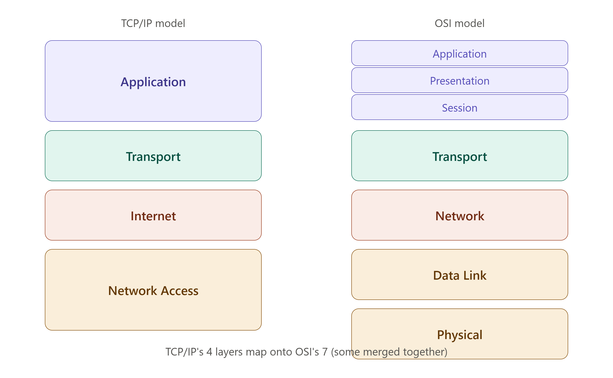

# 🌍 TCP/IP Model

> The **TCP/IP Model** (Transmission Control Protocol/Internet Protocol) is a practical, 4-layer networking framework that forms the actual foundation of how the Internet works today.

---

## 🎯 Why Do We Need the TCP/IP Model?

🔴 OSI is a 7-layer **theoretical** reference model — it was never fully implemented as-is

🔴 Real-world networks (the Internet) needed something simpler and implementable

🔴 TCP/IP was built first by DARPA and became the actual standard the Internet runs on

### Example

```text
Model         | Nature           | Used For
---------------------------------------------------
OSI Model      | Theoretical       | Teaching, troubleshooting reference
TCP/IP Model   | Practical          | Actually runs the Internet
```

---

# 🧠 The Four Layers of TCP/IP

```text
TCP/IP Model
 ↓
 ├── Application Layer       → User-facing protocols (HTTP, FTP, DNS)
 ├── Transport Layer          → End-to-end delivery (TCP, UDP)
 ├── Internet Layer            → Routing & addressing (IP)
 └── Network Access Layer       → Physical transmission (Ethernet, Wi-Fi)
```

> 📌 _See the rendered diagram above showing how TCP/IP's 4 layers map onto OSI's 7 layers — some OSI layers get merged together in TCP/IP._

---

## Layer 1 — Network Access Layer (Link Layer)

### Definition

> Combines the responsibilities of OSI's **Physical** and **Data Link** layers — handles the physical transmission of data and node-to-node delivery within the same network.

### Functions

```text
✔ Defines hardware addressing (MAC addresses)
✔ Handles physical transmission medium
✔ Frame creation and error detection
```

### Protocols/Technologies

```text
Ethernet, Wi-Fi (802.11), ARP, PPP
```

### Interview Shortcut

> **Network Access Layer = OSI's Physical + Data Link layers combined.**

---

## Layer 2 — Internet Layer

### Definition

> Equivalent to OSI's **Network Layer** — responsible for logical addressing, packaging data into packets, and routing them across different networks.

### Functions

```text
✔ Logical (IP) Addressing
✔ Routing packets between networks
✔ Packet fragmentation and reassembly
```

### Protocols

```text
IP (IPv4/IPv6), ICMP, ARP, IGMP
```

### Interview Shortcut

> **Internet Layer = OSI's Network Layer. IP addressing and routing happen here.**

---

## Layer 3 — Transport Layer

### Definition

> Identical in role to OSI's **Transport Layer** — provides end-to-end communication, breaking data into segments and managing reliable or fast delivery.

### Functions

```text
✔ Segmentation of data
✔ Connection-oriented (TCP) or connectionless (UDP) delivery
✔ Flow control and error checking
```

### Protocols

```text
TCP (reliable), UDP (fast)
```

### Interview Shortcut

> **Transport Layer = same as OSI. TCP/UDP live here.**

---

## Layer 4 — Application Layer

### Definition

> Combines OSI's **Session, Presentation, and Application** layers into one — provides the protocols that applications directly use to communicate over the network.

### Functions

```text
✔ Provides network services directly to user applications
✔ Handles data formatting, encryption, and session management internally
```

### Protocols

```text
HTTP/HTTPS, FTP, SMTP, DNS, Telnet, SSH
```

### Interview Shortcut

> **Application Layer = OSI's Session + Presentation + Application merged into one.**

---

# ⚖️ OSI vs TCP/IP — Full Comparison

| Feature | OSI Model | TCP/IP Model |
| -------- | ------------ | --------------- |
| Layers | 7 | 4 |
| Developed By | ISO | DARPA (US Dept. of Defense) |
| Approach | Theoretical, generic reference model | Practical, protocol-specific |
| Layer Merging | Each layer is separate and distinct | Session, Presentation, Application merged into one |
| Reliability | Defined at Network layer too | Reliability defined only at Transport layer |
| Usage Today | Used for teaching & conceptual reference | Used in real-world implementation (the Internet) |

### Layer Mapping Table

| OSI Layer | TCP/IP Layer |
| ----------- | --------------- |
| Application | Application |
| Presentation | Application |
| Session | Application |
| Transport | Transport |
| Network | Internet |
| Data Link | Network Access |
| Physical | Network Access |

---

# 📌 Quick Revision

| TCP/IP Layer | Equivalent OSI Layers | Key Protocols |
| --------------- | ------------------------- | ---------------- |
| Application | Application + Presentation + Session | HTTP, FTP, DNS, SMTP |
| Transport | Transport | TCP, UDP |
| Internet | Network | IP, ICMP |
| Network Access | Data Link + Physical | Ethernet, Wi-Fi |

---

# 🎤 Viva Questions

### What is the TCP/IP Model?

> A 4-layer practical networking model — Application, Transport, Internet, and Network Access — that forms the actual basis of how the Internet operates.

### How many layers does the TCP/IP model have compared to OSI?

> TCP/IP has 4 layers, while OSI has 7 layers — TCP/IP merges several OSI layers together.

### Which OSI layers are merged into the TCP/IP Application layer?

> The OSI Session, Presentation, and Application layers are all merged into the single TCP/IP Application layer.

### Which OSI layers correspond to the TCP/IP Network Access layer?

> The OSI Physical and Data Link layers both correspond to the TCP/IP Network Access layer.

### Why is TCP/IP considered more practical than OSI?

> Because TCP/IP was actually implemented and became the working standard for the Internet, whereas OSI remains primarily a theoretical/teaching reference model.

### What protocols operate at the Internet layer of TCP/IP?

> IP (Internet Protocol), ICMP, ARP, and IGMP operate at the Internet layer.

### Who developed the TCP/IP model?

> It was developed by DARPA (Defense Advanced Research Projects Agency) under the US Department of Defense.

### Does the TCP/IP model define reliability at every layer?

> No, unlike OSI's broader approach, TCP/IP defines reliability mainly at the Transport layer through protocols like TCP.

### What is the equivalent of OSI's Network layer in TCP/IP?

> The Internet layer in TCP/IP is equivalent to OSI's Network layer.

### Why doesn't TCP/IP have separate Session and Presentation layers?

> Because TCP/IP was designed pragmatically around what protocols actually needed — session management and data formatting are handled within the Application layer itself rather than as separate layers.

---

## 🏆 One-Line Summary

```text
Network Access  → OSI Physical + Data Link → Ethernet, Wi-Fi

Internet        → OSI Network               → IP, ICMP

Transport        → OSI Transport              → TCP, UDP

Application       → OSI Session + Presentation + Application → HTTP, FTP, DNS
```

---

<p align="center">
  
</p>

---

## References

1. Andrew S. Tanenbaum — *Computer Networks*, 5th Edition, Pearson
2. Behrouz A. Forouzan — *Data Communications and Networking*, 5th Edition, McGraw-Hill
3. James F. Kurose, Keith W. Ross — *Computer Networking: A Top-Down Approach*, 7th Edition, Pearson

---

<div align="center">

### ⭐ Star this repository if it helped you learn Computer Networks!

</div>
