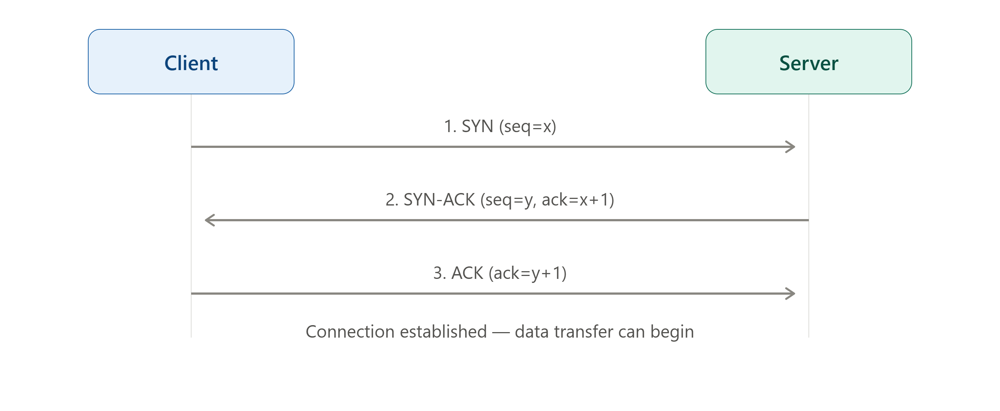

# 🔁 TCP vs UDP

> **TCP** and **UDP** are the two core protocols of the Transport Layer — TCP guarantees reliable, ordered delivery, while UDP prioritizes speed over reliability.

---

## 🎯 Why Two Different Protocols?

🔴 Some applications (file transfer, web pages) **must** receive every byte correctly

🔴 Some applications (video calls, gaming) need **speed** more than perfection — a missing frame is fine

🔴 One protocol can't optimally serve both needs at once

### Example

```text
Application                  | Needs                  | Protocol Used
-----------------------------------------------------------------------
Loading a webpage              | No missing data          | TCP
Sending an email                 | No missing data          | TCP
Video call (Zoom, Google Meet)   | Speed > perfection         | UDP
Online multiplayer gaming         | Speed > perfection         | UDP
DNS lookup                        | Quick, small request        | UDP
```

---

# 🧠 The Two Transport Protocols

```text
Transport Layer Protocols
 ↓
 ├── TCP (Transmission Control Protocol)  → Reliable, connection-oriented
 └── UDP (User Datagram Protocol)         → Fast, connectionless
```

---

# 1️⃣ TCP (Transmission Control Protocol)

### Definition

> TCP is a **connection-oriented** protocol that establishes a dedicated connection before transmitting data, guaranteeing reliable, ordered, and error-checked delivery.

### Rules

✔ Connection must be established first (3-way handshake)

✔ Guarantees delivery — retransmits lost packets

✔ Maintains the order of data exactly as sent

✔ Includes flow control and congestion control

✔ Slower due to overhead, but reliable

### How a TCP Connection Starts — The 3-Way Handshake

> 📌 _See the rendered diagram above showing the full handshake sequence between Client and Server._

```text
Step 1: Client → Server   SYN (seq = x)
Step 2: Server → Client   SYN-ACK (seq = y, ack = x+1)
Step 3: Client → Server   ACK (ack = y+1)
        → Connection Established, data transfer begins
```

### Key Features

```text
✔ Reliable delivery        — lost packets are retransmitted
✔ Ordered delivery          — packets arrive in the same order sent
✔ Error checking             — checksums verify data integrity
✔ Flow control                — prevents overwhelming the receiver
✔ Congestion control           — adjusts speed based on network load
```

### Real-World Applications

```text
Web Browsing (HTTP/HTTPS)
Email (SMTP, IMAP, POP3)
File Transfer (FTP)
Remote Login (SSH)
```

### Interview Shortcut

> **TCP = Connection-oriented, reliable, ordered. Think "registered mail with tracking."**

---

# 2️⃣ UDP (User Datagram Protocol)

### Definition

> UDP is a **connectionless** protocol that sends data without establishing a connection first, prioritizing speed over guaranteed delivery.

### Rules

✔ No connection setup — data is just sent ("fire and forget")

✔ No guarantee of delivery — lost packets are NOT retransmitted

✔ No guarantee of order — packets may arrive out of sequence

✔ Minimal overhead — much faster than TCP

✔ No flow control or congestion control

### How UDP Works

```text
Sender just sends the datagram directly:

Sender → [Data + UDP Header] → Receiver
        (no handshake, no acknowledgment required)
```

### Key Features

```text
✔ Low latency        — minimal overhead, very fast
✔ No retransmission    — lost data stays lost
✔ No ordering guarantee  — packets may arrive in any order
✔ Lightweight header     — only 8 bytes (vs TCP's 20+ bytes)
```

### Real-World Applications

```text
Video Streaming (live broadcasts)
Voice over IP (VoIP) — Zoom, Skype calls
Online Gaming
DNS Queries
DHCP
```

### Interview Shortcut

> **UDP = Connectionless, fast, unreliable. Think "shouting across a room — no confirmation it was heard."**

---

# ⚖️ TCP vs UDP — Full Comparison

| Feature | TCP | UDP |
| -------- | ----- | ----- |
| Connection | Connection-oriented (handshake required) | Connectionless (no handshake) |
| Reliability | Reliable — guarantees delivery | Unreliable — no delivery guarantee |
| Ordering | Maintains order of packets | No ordering guarantee |
| Speed | Slower (due to overhead) | Faster (minimal overhead) |
| Error Checking | Yes, with retransmission | Yes, but no retransmission |
| Flow Control | Yes | No |
| Congestion Control | Yes | No |
| Header Size | 20+ bytes | 8 bytes |
| Use Case | Web, Email, File Transfer | Streaming, Gaming, VoIP, DNS |

---

# 📌 Quick Revision

| Protocol | Core Idea | Best For |
| ---------- | ----------- | ---------- |
| TCP | Reliable, ordered, connection-based | Accuracy-critical tasks |
| UDP | Fast, connectionless, no guarantees | Speed-critical, real-time tasks |

---

# 🎤 Viva Questions

### What is the main difference between TCP and UDP?

> TCP is connection-oriented and guarantees reliable, ordered delivery, while UDP is connectionless and prioritizes speed without guaranteeing delivery or order.

### What is the 3-way handshake in TCP?

> The process of establishing a TCP connection: the client sends a SYN, the server responds with SYN-ACK, and the client confirms with an ACK — after which data transfer begins.

### Why is UDP faster than TCP?

> Because UDP has no connection setup, no acknowledgment system, no retransmission, and a much smaller header (8 bytes vs TCP's 20+ bytes), resulting in much less overhead.

### Why would an application choose UDP over TCP despite the unreliability?

> Because for real-time applications like video calls or gaming, a few lost packets are acceptable, but the delay caused by TCP's retransmission and ordering guarantees would hurt the real-time experience more.

### What does "connectionless" mean in the context of UDP?

> It means UDP sends data without first establishing a dedicated connection between sender and receiver — each datagram is sent independently ("fire and forget").

### What is flow control and which protocol uses it?

> Flow control is a mechanism to prevent a sender from overwhelming a receiver with too much data too quickly. TCP uses flow control; UDP does not.

### What is congestion control and which protocol uses it?

> Congestion control allows a protocol to adjust its sending rate based on network congestion. TCP includes congestion control mechanisms; UDP does not.

### Does UDP guarantee the order of received packets?

> No, UDP does not guarantee order — packets may arrive in a different sequence than they were sent, and it's up to the application to handle reordering if needed.

### Give two real-world applications each for TCP and UDP.

> TCP: Web browsing (HTTP/HTTPS), Email (SMTP). UDP: Video streaming, Online gaming.

### What happens to a lost packet in TCP versus UDP?

> In TCP, a lost packet is detected and automatically retransmitted. In UDP, a lost packet is simply gone — there is no retransmission mechanism.

---

## 🏆 One-Line Summary

```text
TCP   → Connection-oriented, reliable, ordered   → Web, Email, File Transfer

UDP   → Connectionless, fast, unreliable          → Streaming, Gaming, VoIP, DNS
```

---

<p align="center">
  
</p>

## References

1. Behrouz A. Forouzan — *Data Communications and Networking*, 5th Edition, McGraw-Hill
2. James F. Kurose, Keith W. Ross — *Computer Networking: A Top-Down Approach*, 7th Edition, Pearson
3. Andrew S. Tanenbaum — *Computer Networks*, 5th Edition, Pearson

---

<div align="center">

### ⭐ Star this repository if it helped you learn Computer Networks!

</div>
