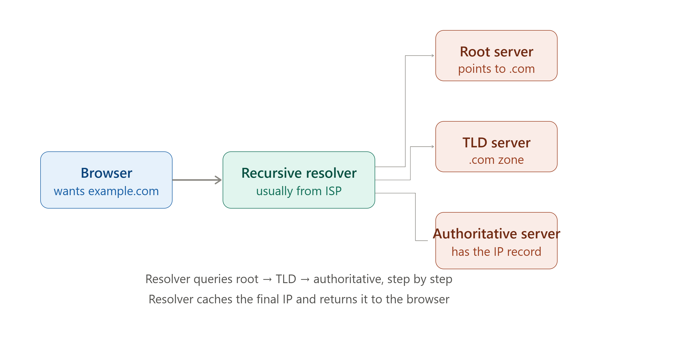

# 🧭 DNS & How It Works

> **DNS (Domain Name System)** is a hierarchical naming system that translates human-friendly domain names (like `google.com`) into machine-friendly IP addresses (like `142.250.182.46`).

---

## 🎯 Why Do We Need DNS?

🔴 Humans remember names easily, but computers communicate using IP addresses

🔴 Without DNS, you'd have to memorize numeric IP addresses for every website you visit

🔴 IP addresses of servers can change — DNS allows the name to stay constant

### Example

```text
Without DNS                          | With DNS
-----------------------------------------------------------
Typing 142.250.182.46 in browser      | Typing google.com in browser
Hard to remember, error-prone           | Easy to remember, human-friendly
Breaks if server IP changes              | Still works even if IP changes
```

---

# 🧠 The DNS Hierarchy

```text
DNS Hierarchy (Top to Bottom)
 ↓
 ├── Root Server           → The starting point ( . )
 ├── TLD Server              → Top-Level Domain (.com, .org, .in)
 ├── Authoritative Server      → Holds the actual DNS records for a domain
 └── Recursive Resolver          → Does the lookup work on your behalf
```

---

# 1️⃣ What Is a Domain Name?

### Definition

> A Domain Name is a human-readable address (e.g., `www.example.com`) used to identify a website or resource on the Internet, which DNS maps to its underlying IP address.

### Anatomy of a Domain Name

```text
        www.example.com.
         │      │      │  │
   Subdomain  Domain  TLD Root
                          (implicit, often omitted)
```

| Part | Example | Meaning |
| ------ | --------- | --------- |
| Root | `.` (implicit) | Top of the DNS hierarchy |
| TLD | `.com` | Top-Level Domain |
| Domain | `example` | Registered domain name |
| Subdomain | `www` | Optional prefix (e.g., www, mail, blog) |

### Interview Shortcut

> **Domain Name = human-readable label. DNS converts it into a machine-readable IP address.**

---

# 2️⃣ Types of DNS Servers

### Root Server

> The starting point of any DNS lookup. There are only 13 logical root server clusters worldwide. It doesn't know the final IP — it knows which TLD server to ask next.

### TLD (Top-Level Domain) Server

> Manages information for domains under a specific TLD (e.g., `.com`, `.org`, `.in`). Points the resolver toward the correct Authoritative server.

### Authoritative Name Server

> Holds the actual DNS records (like the IP address) for a specific domain. This is the final source of truth.

### Recursive Resolver

> Usually provided by your ISP or a public DNS service (like Google DNS `8.8.8.8`). It does the legwork of querying Root → TLD → Authoritative servers on your behalf, then returns the final answer to your browser.

### Interview Shortcut

> **Root → TLD → Authoritative = the lookup chain. Recursive Resolver = the one doing the asking.**

---

# 3️⃣ How DNS Resolution Works (Step-by-Step)

> 📌 _See the rendered diagram above showing the full DNS resolution flow from Browser → Resolver → Root → TLD → Authoritative server._

### The Process

```text
Step 1: User types "example.com" in the browser
Step 2: Browser asks the Recursive Resolver (usually from ISP)
Step 3: Resolver checks its cache — if found, returns immediately
Step 4: If not cached, Resolver asks the Root Server
         → Root Server says: "Ask the .com TLD server"
Step 5: Resolver asks the TLD Server
         → TLD Server says: "Ask example.com's Authoritative server"
Step 6: Resolver asks the Authoritative Server
         → Authoritative Server returns the actual IP address
Step 7: Resolver caches the result and returns the IP to the browser
Step 8: Browser connects directly to that IP address
```

### Interview Shortcut

> **DNS Resolution = Resolver asks Root → TLD → Authoritative, step by step, then caches the answer.**

---

# 4️⃣ Types of DNS Records

### Definition

> DNS Records are entries stored on Authoritative servers that define how a domain should be handled — what IP it points to, mail servers, aliases, etc.

| Record Type | Purpose |
| -------------- | --------- |
| **A** | Maps a domain to an IPv4 address |
| **AAAA** | Maps a domain to an IPv6 address |
| **CNAME** | Maps a domain/subdomain to another domain name (alias) |
| **MX** | Specifies mail servers responsible for the domain |
| **NS** | Specifies the authoritative name servers for the domain |
| **TXT** | Holds arbitrary text (often used for verification, SPF records) |
| **PTR** | Maps an IP address back to a domain name (reverse DNS) |

### Example

```text
A Record:      example.com       →  93.184.216.34
CNAME Record:   www.example.com   →  example.com
MX Record:       example.com       →  mail.example.com (priority 10)
```

### Interview Shortcut

> **A = IPv4. AAAA = IPv6. CNAME = alias. MX = mail server. NS = name server.**

---

# 5️⃣ DNS Caching

### Definition

> DNS Caching temporarily stores previously resolved domain-to-IP mappings, so repeated lookups don't need to repeat the entire resolution process — significantly speeding up browsing.

### Where Caching Happens

```text
✔ Browser cache       — stores recent lookups locally
✔ OS cache              — operating system level DNS cache
✔ Resolver cache          — ISP/recursive resolver caches results
✔ TTL (Time To Live)        — defines how long a record stays cached
```

### Interview Shortcut

> **Caching = avoids repeating the full Root → TLD → Authoritative chain every time. TTL controls how long it's remembered.**

---

# 6️⃣ Recursive vs Iterative DNS Queries

### Recursive Query

> The client asks the resolver for a complete answer, and the resolver is responsible for doing all the work (querying Root, TLD, Authoritative) until it gets the final answer.

### Iterative Query

> The resolver asks each server in the chain, and each server responds with either the final answer or a referral to the next server to ask — the resolver follows the referrals itself.

```text
Recursive: "Just give me the final IP address." (client → resolver)
Iterative:  "Here's who to ask next." (resolver → root/TLD/authoritative)
```

### Interview Shortcut

> **Recursive = client expects the full answer. Iterative = server just gives the next hint.**

---

# ⚖️ DNS Server Types — Quick Comparison

| Server Type | Role | Knows Final IP? |
| -------------- | ------ | ------------------- |
| Root Server | Points to the correct TLD server | No |
| TLD Server | Points to the correct Authoritative server | No |
| Authoritative Server | Holds the actual DNS record | Yes |
| Recursive Resolver | Does the lookup work on behalf of the client | Gets it from Authoritative, then caches |

---

# 📌 Quick Revision

| Concept | Core Idea |
| --------- | ----------- |
| DNS | Translates domain names into IP addresses |
| Root Server | Starting point of DNS lookup |
| TLD Server | Manages a specific top-level domain (.com, .org) |
| Authoritative Server | Holds the actual IP record |
| Recursive Resolver | Performs the lookup on the client's behalf |
| DNS Records | A, AAAA, CNAME, MX, NS, TXT, PTR |
| Caching | Speeds up repeated lookups using TTL |

---

# 🎤 Viva Questions

### What is DNS and why is it needed?

> DNS (Domain Name System) translates human-readable domain names into machine-readable IP addresses, so users don't need to memorize numeric addresses to access websites.

### What is the role of a Root Server in DNS?

> The Root Server is the starting point of any DNS lookup — it doesn't know the final IP address but directs the resolver to the correct TLD server.

### What is the difference between a TLD Server and an Authoritative Server?

> A TLD Server manages a category of domains (like .com or .org) and points to the correct Authoritative server, while the Authoritative Server actually holds the final DNS record (IP address) for the domain.

### What is a Recursive Resolver?

> A server, usually provided by an ISP, that performs the entire DNS lookup process on behalf of the client — querying Root, TLD, and Authoritative servers until it finds the answer.

### What is the difference between an A record and a CNAME record?

> An A record maps a domain name directly to an IPv4 address, while a CNAME record maps a domain/subdomain to another domain name (an alias).

### What is DNS caching and why is it useful?

> DNS caching temporarily stores previously resolved domain-to-IP mappings so future lookups for the same domain are instant, reducing load and lookup time.

### What is TTL in the context of DNS?

> TTL (Time To Live) defines how long a DNS record should be cached before it needs to be looked up again from the authoritative source.

### What is the difference between a Recursive query and an Iterative query?

> In a Recursive query, the resolver does all the work and returns the final answer to the client. In an Iterative query, each server returns either the answer or a referral to the next server, and the resolver follows these referrals itself.

### What does an MX record specify?

> An MX (Mail Exchange) record specifies the mail server(s) responsible for receiving email on behalf of a domain.

### What happens if a domain's DNS record is not found in any cache?

> The Recursive Resolver performs a full lookup, querying the Root Server, then the TLD Server, then the Authoritative Server, to find the final IP address before caching and returning it.

---

## 🏆 One-Line Summary

```text
DNS                  → Translates domain names into IP addresses

Root Server            → Points to the right TLD server

TLD Server               → Points to the right Authoritative server

Authoritative Server      → Holds the actual IP record

Recursive Resolver           → Does the lookup chain on the client's behalf

DNS Records                    → A, AAAA, CNAME, MX, NS, TXT, PTR

Caching                          → Speeds up repeat lookups via TTL
```

---


<p align="center">
  
</p>

## References

1. Behrouz A. Forouzan — *Data Communications and Networking*, 5th Edition, McGraw-Hill
2. James F. Kurose, Keith W. Ross — *Computer Networking: A Top-Down Approach*, 7th Edition, Pearson
3. Andrew S. Tanenbaum — *Computer Networks*, 5th Edition, Pearson

---

<div align="center">

### ⭐ Star this repository if it helped you learn Computer Networks!

</div>
