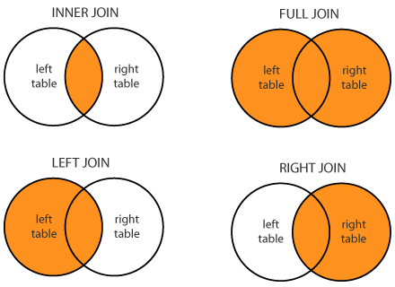

# 🔗 Joins in SQL

> A **Join** is an SQL operation used to combine rows from two or more tables based on a related column between them, allowing data spread across multiple tables to be retrieved as a single result set.

---

## 🎯 Why Do We Need Joins?

🔴 Normalized databases split data across multiple tables — joins bring it back together

🔴 Without joins, you'd have to manually cross-reference data using multiple queries

🔴 Real-world queries almost always need data from more than one table

### Example

```text
Task                                          | Tables Involved      | Join Needed
-----------------------------------------------------------------------------------
Show employee name with their department       | Employee, Department  | Yes
List all customers, even those with no orders   | Customer, Orders       | Yes (Outer)
Find products never ordered                      | Product, OrderItems    | Yes (Outer)
```

---

# 🧠 The Join Family

```text
SQL Joins
 ↓
 ├── Inner Join
 ├── Outer Join
 │     ├── Left Outer Join
 │     ├── Right Outer Join
 │     └── Full Outer Join
 ├── Cross Join
 ├── Self Join
 └── Natural Join
```

---

## 📋 Sample Tables Used Throughout

**Employee**

| EmpID | EmpName | DeptID |
| ------- | --------- | -------- |
| 1 | Alice | 10 |
| 2 | Bob | 20 |
| 3 | Carol | NULL |

**Department**

| DeptID | DeptName |
| -------- | ---------- |
| 10 | IT |
| 20 | HR |
| 30 | Finance |

> Notice: Carol has no department, and Finance has no employees — these gaps are what differentiate the join types below.

---

# 1️⃣ Inner Join (Equi Join)

### Definition

> An Inner Join returns only the rows that have **matching values in both tables**. Non-matching rows are excluded.

### Rules

✔ Returns intersection of both tables

✔ Most commonly used join type

✔ Rows without a match on either side are dropped

### Syntax

```sql
SELECT Employee.EmpName, Department.DeptName
FROM Employee
INNER JOIN Department
ON Employee.DeptID = Department.DeptID;
```

### Result

| EmpName | DeptName |
| --------- | ---------- |
| Alice | IT |
| Bob | HR |

> Carol (NULL DeptID) and Finance (no employees) are both excluded — only matches survive.

### Visual Idea

```text
Employee ─┐
          ├──●●●──  (only overlapping matches returned)
Department┘
```

### Interview Shortcut

> **Inner Join = only matching rows from both tables (intersection).**

---

# 2️⃣ Left Outer Join (Left Join)

### Definition

> A Left Join returns **all rows from the left table**, along with matching rows from the right table. If there's no match, NULL is returned for right table columns.

### Rules

✔ All rows from the left table are always included

✔ Unmatched right-table columns appear as NULL

✔ Used when you don't want to lose any left-table records

### Syntax

```sql
SELECT Employee.EmpName, Department.DeptName
FROM Employee
LEFT JOIN Department
ON Employee.DeptID = Department.DeptID;
```

### Result

| EmpName | DeptName |
| --------- | ---------- |
| Alice | IT |
| Bob | HR |
| Carol | NULL |

> Carol is kept (she's in the left table) even though she has no department.

### Visual Idea

```text
Employee (ALL) ─┐
                 ├──●●●○──   ○ = NULL filled in
Department      ─┘
```

### Interview Shortcut

> **Left Join = everything from the left, matched data from the right, NULL if no match.**

---

# 3️⃣ Right Outer Join (Right Join)

### Definition

> A Right Join returns **all rows from the right table**, along with matching rows from the left table. If there's no match, NULL is returned for left table columns.

### Rules

✔ All rows from the right table are always included

✔ Unmatched left-table columns appear as NULL

✔ Less commonly used — often rewritten as a Left Join by swapping table order

### Syntax

```sql
SELECT Employee.EmpName, Department.DeptName
FROM Employee
RIGHT JOIN Department
ON Employee.DeptID = Department.DeptID;
```

### Result

| EmpName | DeptName |
| --------- | ---------- |
| Alice | IT |
| Bob | HR |
| NULL | Finance |

> Finance is kept (it's in the right table) even though no employee belongs to it.

### Visual Idea

```text
Employee        ─┐
                  ├──●●●○──   ○ = NULL filled in
Department (ALL) ─┘
```

### Interview Shortcut

> **Right Join = everything from the right, matched data from the left, NULL if no match.**

---

# 4️⃣ Full Outer Join

### Definition

> A Full Outer Join returns **all rows from both tables**, matching where possible, and filling NULL where no match exists on either side.

### Rules

✔ Combines the effect of Left Join + Right Join

✔ No row from either table is lost

✔ Not supported directly in MySQL (simulated using `UNION` of Left and Right joins)

### Syntax

```sql
SELECT Employee.EmpName, Department.DeptName
FROM Employee
FULL OUTER JOIN Department
ON Employee.DeptID = Department.DeptID;
```

### Result

| EmpName | DeptName |
| --------- | ---------- |
| Alice | IT |
| Bob | HR |
| Carol | NULL |
| NULL | Finance |

> Both Carol and Finance survive — nothing is dropped from either side.

### MySQL Workaround

```sql
SELECT Employee.EmpName, Department.DeptName
FROM Employee LEFT JOIN Department ON Employee.DeptID = Department.DeptID
UNION
SELECT Employee.EmpName, Department.DeptName
FROM Employee RIGHT JOIN Department ON Employee.DeptID = Department.DeptID;
```

### Interview Shortcut

> **Full Outer Join = everything from both tables, NULLs filled wherever there's no match.**

---

# 5️⃣ Cross Join

### Definition

> A Cross Join returns the **Cartesian product** of two tables — every row of the first table combined with every row of the second table.

### Rules

✔ No join condition (`ON` clause) is used

✔ Result size = (rows in Table A) × (rows in Table B)

✔ Rarely used directly in real applications — mostly for generating combinations

### Syntax

```sql
SELECT Employee.EmpName, Department.DeptName
FROM Employee
CROSS JOIN Department;
```

### Result (3 employees × 3 departments = 9 rows)

```text
Alice - IT       Alice - HR       Alice - Finance
Bob   - IT       Bob   - HR       Bob   - Finance
Carol - IT       Carol - HR       Carol - Finance
```

### Interview Shortcut

> **Cross Join = every row pairs with every other row. No condition. Result size multiplies.**

---

# 6️⃣ Self Join

### Definition

> A Self Join is when a table is joined **with itself**, typically used to compare rows within the same table — common for hierarchical data like employee-manager relationships.

### Rules

✔ Same table is referenced twice using different aliases

✔ Useful for parent-child / hierarchical relationships

✔ Requires aliasing to distinguish the two instances of the table

### Example Table

**Employee**

| EmpID | EmpName | ManagerID |
| ------- | --------- | ----------- |
| 1 | Alice | NULL |
| 2 | Bob | 1 |
| 3 | Carol | 1 |

### Syntax

```sql
SELECT E.EmpName AS Employee, M.EmpName AS Manager
FROM Employee E
LEFT JOIN Employee M
ON E.ManagerID = M.EmpID;
```

### Result

| Employee | Manager |
| ---------- | --------- |
| Alice | NULL |
| Bob | Alice |
| Carol | Alice |

### Interview Shortcut

> **Self Join = a table joined with itself using two aliases — great for hierarchies.**

---

# 7️⃣ Natural Join

### Definition

> A Natural Join automatically joins two tables based on **all columns with the same name and compatible data type** — no explicit `ON` condition needed.

### Rules

✔ No `ON` clause required

✔ Automatically matches columns with identical names in both tables

✔ Risky if multiple columns accidentally share the same name

### Syntax

```sql
SELECT *
FROM Employee
NATURAL JOIN Department;
```

> If both tables have a `DeptID` column, it's used automatically as the join condition.

### Interview Shortcut

> **Natural Join = automatic join on same-named columns. Convenient but less explicit/controllable.**

---

# ⚖️ Join Comparison Table

| Join Type | Returns | Unmatched Left | Unmatched Right |
| ----------- | --------- | ----------------- | ------------------ |
| Inner Join | Only matches | Excluded | Excluded |
| Left Join | All left + matches | Included (NULL on right) | Excluded |
| Right Join | All right + matches | Excluded | Included (NULL on left) |
| Full Outer Join | Everything | Included | Included |
| Cross Join | All combinations | N/A | N/A |
| Self Join | Table joined with itself | Depends on join type used | Depends on join type used |

---

# 📌 Quick Revision

| Join | Core Idea |
| ------ | ----------- |
| Inner Join | Only common/matching rows |
| Left Join | All of left table + matches |
| Right Join | All of right table + matches |
| Full Outer Join | All rows from both tables |
| Cross Join | Cartesian product (no condition) |
| Self Join | Table joined to itself |
| Natural Join | Auto-join on same-named columns |

---

# 🎤 Viva Questions

### What is a Join in SQL?

> A Join is an operation that combines rows from two or more tables based on a related column between them.

### What is the difference between Inner Join and Outer Join?

> Inner Join returns only matching rows from both tables. Outer Join (Left/Right/Full) returns matching rows plus unmatched rows from one or both tables, filling NULL where there's no match.

### What is the difference between Left Join and Right Join?

> Left Join keeps all rows from the left table with matches from the right. Right Join keeps all rows from the right table with matches from the left.

### What does a Full Outer Join return?

> It returns all rows from both tables, matching where possible and filling NULL where no match exists on either side.

### What is a Cross Join?

> A Cross Join returns the Cartesian product of two tables — every row from the first table paired with every row from the second, with no join condition.

### What is a Self Join used for?

> It's used to join a table with itself, commonly to model hierarchical relationships like employees and their managers within the same table.

### What is a Natural Join?

> A join that automatically matches columns with the same name and compatible data types across two tables, without requiring an explicit ON condition.

### Why might a Natural Join be risky to use?

> Because it joins on ALL same-named columns automatically — if two unrelated columns happen to share a name, it can produce incorrect or unexpected results.

### Does MySQL support Full Outer Join directly?

> No, MySQL does not support FULL OUTER JOIN directly — it's typically simulated using a UNION of a LEFT JOIN and a RIGHT JOIN.

### If Table A has 4 rows and Table B has 5 rows, how many rows does a Cross Join return?

> 20 rows (4 × 5) — the Cartesian product of both tables.

---

## 🏆 One-Line Summary

```text
Inner Join       → Only matching rows

Left Join        → All left + matched right (NULL if no match)

Right Join       → All right + matched left (NULL if no match)

Full Outer Join  → All rows from both tables

Cross Join       → Every row pairs with every row (Cartesian product)

Self Join        → Table joined with itself

Natural Join     → Auto-join on same-named columns
```

---

<p align="center">
  
</p>


## References

1. Korth, Silberschatz, Sudarshan — *Database System Concepts*, 6th Edition, McGraw-Hill
2. Elmasri and Navathe — *Fundamentals of Database Systems*, 5th Edition, Pearson
3. G. K. Gupta — *Database Management Systems*, McGraw-Hill

---

<div align="center">

### ⭐ Star this repository if it helped you learn DBMS!

</div>
