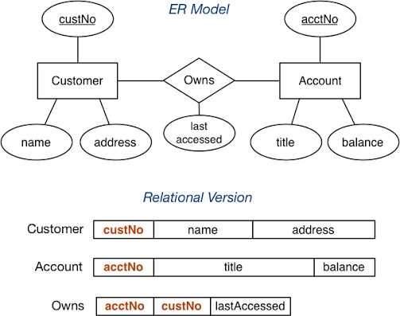

# 🔄 ER to Relational Mapping

> **ER to Relational Mapping** is the process of converting an Entity-Relationship (ER/EER) diagram into a set of relational tables (schemas) that can be implemented in a database using SQL.

---

## 🎯 Why Do We Need Mapping Rules?

🔴 An ER diagram is just a conceptual design — it can't be queried directly

🔴 Different ER components (entities, relationships, cardinalities) need different table structures

🔴 Without consistent rules, the same diagram could be translated incorrectly in many ways

### Example

```text
ER Component                | Becomes in Relational Model
-------------------------------------------------------------
Strong Entity                 | A table with a primary key
Weak Entity                   | A table with a composite key (owner PK + partial key)
1:N Relationship               | Foreign key on the "many" side
M:N Relationship                | A brand new junction/bridge table
Multivalued Attribute           | A separate table
```

---

# 🧠 The Mapping Roadmap

```text
ER / EER Diagram
 ↓
 ├── Step 1: Map Regular (Strong) Entities
 ├── Step 2: Map Weak Entities
 ├── Step 3: Map Binary 1:1 Relationships
 ├── Step 4: Map Binary 1:N Relationships
 ├── Step 5: Map Binary M:N Relationships
 ├── Step 6: Map Multivalued Attributes
 ├── Step 7: Map N-ary Relationships
 └── Step 8: Map Specialization / Generalization (EER)
```

---

# 1️⃣ Mapping Regular (Strong) Entities

### Definition

> Every strong entity in the ER diagram becomes a separate table, with all its simple attributes becoming columns and its key attribute becoming the primary key.

### Rules

✔ One table per strong entity

✔ All simple attributes → columns

✔ Key attribute → Primary Key

✔ Composite attributes → split into individual columns

### Example

```text
Entity: Student (StudentID, Name, Email)
```

```sql
CREATE TABLE Student (
    StudentID INT PRIMARY KEY,
    Name VARCHAR(50),
    Email VARCHAR(50)
);
```

### Interview Shortcut

> **Strong Entity → Table. Key attribute → Primary Key.**

---

# 2️⃣ Mapping Weak Entities

### Definition

> A weak entity becomes a table that includes its own attributes, plus a **foreign key** referencing its owner entity's primary key. The primary key of this new table is a **combination** of the owner's key and the weak entity's partial key.

### Rules

✔ Include all simple attributes of the weak entity

✔ Add the owner entity's primary key as a foreign key

✔ Primary Key = {Owner's PK + Partial Key}

### Example

```text
Weak Entity: Dependent (DependentName, DOB)
Owner Entity: Employee (EmpID)
```

```sql
CREATE TABLE Dependent (
    EmpID INT,
    DependentName VARCHAR(50),
    DOB DATE,
    PRIMARY KEY (EmpID, DependentName),
    FOREIGN KEY (EmpID) REFERENCES Employee(EmpID)
);
```

### Interview Shortcut

> **Weak Entity → Table with composite PK = Owner's PK + Partial Key.**

---

# 3️⃣ Mapping Binary 1:1 Relationships

### Definition

> For a 1:1 relationship, the primary key of **one** entity is added as a foreign key in the **other** entity's table (preferably the one with total participation).

### Rules

✔ Choose the entity with total participation to hold the foreign key (reduces NULLs)

✔ Only one foreign key needed — not two

✔ Relationship attributes (if any) go along with the foreign key

### Example

```text
Employee (1) ── manages ── (1) Department
```

```sql
CREATE TABLE Department (
    DeptID INT PRIMARY KEY,
    DeptName VARCHAR(50),
    ManagerID INT,
    FOREIGN KEY (ManagerID) REFERENCES Employee(EmpID)
);
```

### Interview Shortcut

> **1:1 Relationship → FK on either side; pick the side with total participation.**

---

# 4️⃣ Mapping Binary 1:N Relationships

### Definition

> For a 1:N relationship, the primary key of the entity on the **"1" side** is added as a foreign key in the table representing the entity on the **"N" side**.

### Rules

✔ Foreign key always goes on the "many" side

✔ No new table is created

✔ Relationship attributes (if any) are added to the "many" side table

### Example

```text
Department (1) ── has ── (N) Employee
```

```sql
CREATE TABLE Employee (
    EmpID INT PRIMARY KEY,
    EmpName VARCHAR(50),
    DeptID INT,
    FOREIGN KEY (DeptID) REFERENCES Department(DeptID)
);
```

### Interview Shortcut

> **1:N Relationship → FK goes on the "Many" side. No new table needed.**

---

# 5️⃣ Mapping Binary M:N Relationships

### Definition

> For a Many-to-Many relationship, a **brand new table** (junction/bridge table) is created containing the primary keys of both participating entities as foreign keys. Together, they form the new table's composite primary key.

### Rules

✔ Always creates a new table

✔ New table's PK = combination of both entities' PKs

✔ Relationship attributes (if any) become columns in this new table

### Example

```text
Student (M) ── enrolls ── (N) Course
```

```sql
CREATE TABLE Enrollment (
    StudentID INT,
    CourseID INT,
    Grade VARCHAR(2),
    PRIMARY KEY (StudentID, CourseID),
    FOREIGN KEY (StudentID) REFERENCES Student(StudentID),
    FOREIGN KEY (CourseID) REFERENCES Course(CourseID)
);
```

### Interview Shortcut

> **M:N Relationship → New junction table. PK = both entities' PKs combined.**

---

# 6️⃣ Mapping Multivalued Attributes

### Definition

> Each multivalued attribute is converted into its **own separate table**, containing the attribute itself plus the primary key of the owning entity as a foreign key.

### Rules

✔ One new table per multivalued attribute

✔ New table's PK = {Owner's PK + the multivalued attribute itself}

✔ Prevents repeating groups (ensures 1NF)

### Example

```text
Entity: Employee (EmpID, Name)
Multivalued Attribute: PhoneNumber
```

```sql
CREATE TABLE EmployeePhone (
    EmpID INT,
    PhoneNumber VARCHAR(15),
    PRIMARY KEY (EmpID, PhoneNumber),
    FOREIGN KEY (EmpID) REFERENCES Employee(EmpID)
);
```

### Interview Shortcut

> **Multivalued Attribute → Separate table. PK = Owner's PK + the attribute.**

---

# 7️⃣ Mapping N-ary Relationships (n > 2)

### Definition

> For relationships involving **more than two entities**, a new table is created containing the primary keys of all participating entities as foreign keys.

### Rules

✔ Always creates a new table

✔ Foreign keys reference all participating entities

✔ Relationship attributes (if any) become columns in this new table

### Example

```text
Relationship: Supplies (Supplier, Part, Project)
```

```sql
CREATE TABLE Supplies (
    SupplierID INT,
    PartID INT,
    ProjectID INT,
    Quantity INT,
    PRIMARY KEY (SupplierID, PartID, ProjectID),
    FOREIGN KEY (SupplierID) REFERENCES Supplier(SupplierID),
    FOREIGN KEY (PartID) REFERENCES Part(PartID),
    FOREIGN KEY (ProjectID) REFERENCES Project(ProjectID)
);
```

### Interview Shortcut

> **N-ary Relationship → New table with FKs from all n entities.**

---

# 8️⃣ Mapping Specialization / Generalization (EER)

### Definition

> EER hierarchies (superclass-subclass) can be mapped using one of several strategies, depending on whether the specialization is total/partial and disjoint/overlapping.

### Option A — Multiple Tables (Superclass + Subclasses)

> Create a table for the superclass and one table per subclass, each subclass table holding only its own specific attributes plus the superclass's PK as both PK and FK.

```sql
CREATE TABLE Employee (
    EmpID INT PRIMARY KEY,
    Name VARCHAR(50)
);

CREATE TABLE Engineer (
    EmpID INT PRIMARY KEY,
    Specialization VARCHAR(50),
    FOREIGN KEY (EmpID) REFERENCES Employee(EmpID)
);

CREATE TABLE Manager (
    EmpID INT PRIMARY KEY,
    TeamSize INT,
    FOREIGN KEY (EmpID) REFERENCES Employee(EmpID)
);
```

> ✅ Works for any specialization (total/partial, disjoint/overlapping)

### Option B — Subclass Tables Only

> Used only when the specialization is **total** and **disjoint**. No separate superclass table — each subclass table includes all inherited + specific attributes.

```sql
CREATE TABLE Engineer (
    EmpID INT PRIMARY KEY,
    Name VARCHAR(50),
    Specialization VARCHAR(50)
);

CREATE TABLE Manager (
    EmpID INT PRIMARY KEY,
    Name VARCHAR(50),
    TeamSize INT
);
```

### Option C — Single Table with One Type Attribute

> Used when subclasses are **disjoint**. One table holds all attributes from superclass and all subclasses, plus a "type" column to indicate which subclass each row belongs to. Causes many NULLs.

```sql
CREATE TABLE Employee (
    EmpID INT PRIMARY KEY,
    Name VARCHAR(50),
    EmpType VARCHAR(20),       -- 'Engineer' or 'Manager'
    Specialization VARCHAR(50), -- NULL if not Engineer
    TeamSize INT                -- NULL if not Manager
);
```

### Option D — Single Table with Multiple Type Attributes

> Used when subclasses are **overlapping** (an entity can belong to more than one subclass). Uses multiple boolean/flag columns instead of one type column.

```sql
CREATE TABLE Employee (
    EmpID INT PRIMARY KEY,
    Name VARCHAR(50),
    IsEngineer BOOLEAN,
    IsManager BOOLEAN,
    Specialization VARCHAR(50),
    TeamSize INT
);
```

### Interview Shortcut

> **Specialization mapping has 4 options — pick based on total/partial + disjoint/overlapping nature.**

---

# ⚖️ Quick Comparison — All Mapping Rules

| ER Component | Relational Mapping |
| --------------- | --------------------- |
| Strong Entity | Table with PK |
| Weak Entity | Table with PK = Owner PK + Partial Key |
| 1:1 Relationship | FK on either side (prefer total participation side) |
| 1:N Relationship | FK on the "Many" side |
| M:N Relationship | New junction table with combined PK |
| Multivalued Attribute | New table with PK = Owner PK + Attribute |
| N-ary Relationship | New table with FKs from all entities |
| Specialization/Generalization | 4 options based on total/partial, disjoint/overlapping |

---

# 📌 Quick Revision

| Step | Action |
| ------ | -------- |
| 1 | Strong Entity → Table |
| 2 | Weak Entity → Table + Owner's FK |
| 3 | 1:1 → FK on one side |
| 4 | 1:N → FK on "many" side |
| 5 | M:N → New junction table |
| 6 | Multivalued Attribute → New table |
| 7 | N-ary → New table with all FKs |
| 8 | Specialization → 4 possible strategies |

---

# 🎤 Viva Questions

### What is ER to Relational Mapping?

> The process of converting entities, attributes, and relationships from an ER/EER diagram into relational tables that can be implemented in a database.

### How is a strong entity mapped to a relational table?

> A table is created with all the entity's simple attributes as columns, and its key attribute becomes the primary key.

### How is a weak entity mapped differently from a strong entity?

> A weak entity's table includes the owner entity's primary key as a foreign key, and its own primary key is a combination of the owner's key and its partial key.

### Where does the foreign key go in a 1:N relationship?

> The foreign key is placed on the table representing the entity on the "many" side, referencing the primary key of the entity on the "1" side.

### How is a Many-to-Many relationship mapped?

> A new junction (bridge) table is created, containing the primary keys of both participating entities as foreign keys, which together form its composite primary key.

### How are multivalued attributes handled in relational mapping?

> A new table is created for the multivalued attribute, with its primary key being the combination of the owning entity's primary key and the attribute itself.

### What are the four options for mapping specialization/generalization?

> (A) Multiple tables for superclass and subclasses, (B) Subclass tables only (for total, disjoint specialization), (C) Single table with one type attribute (for disjoint subclasses), (D) Single table with multiple type attributes (for overlapping subclasses).

### Why does Option C (single table with one type attribute) cause NULL values?

> Because it stores all possible subclass-specific attributes in one table, but each row only belongs to one subclass, leaving the other subclasses' attribute columns empty (NULL).

### How is an N-ary relationship (more than 2 entities) mapped?

> A new table is created containing foreign keys referencing all participating entities, with the combination of these foreign keys typically forming the primary key.

### Why is the foreign key placed on the "many" side in a 1:N relationship rather than the "1" side?

> Because each "many"-side row relates to only one "1"-side row, so storing the foreign key there avoids needing repeating/multivalued columns on the "1" side.

---

## 🏆 One-Line Summary

```text
Strong Entity      → Table with PK

Weak Entity        → Table with PK = Owner PK + Partial Key

1:1 Relationship    → FK on either side

1:N Relationship    → FK on the "Many" side

M:N Relationship     → New junction table

Multivalued Attr.    → New table with Owner PK + Attribute

N-ary Relationship   → New table with FKs from all entities

Specialization        → 4 mapping options (total/partial, disjoint/overlapping)
```

---

<p align="center">
  
</p>

## References

1. Elmasri and Navathe — *Fundamentals of Database Systems*, 5th Edition, Pearson
2. Korth, Silberschatz, Sudarshan — *Database System Concepts*, 6th Edition, McGraw-Hill
3. Peter Rob and Carlos Coronel — *Database Systems: Design, Implementation and Management*, 5th Edition

---

<div align="center">

### ⭐ Star this repository if it helped you learn DBMS!

</div>
