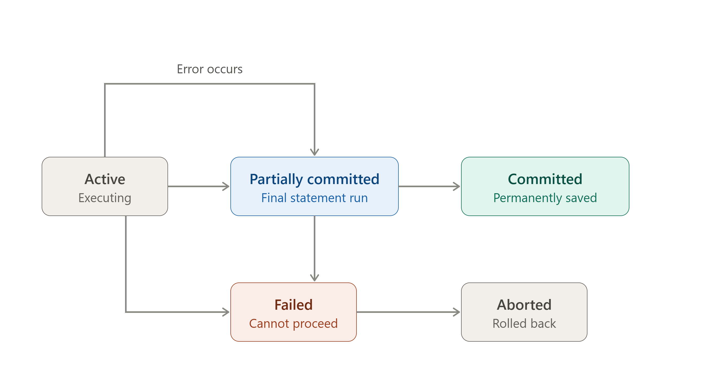

# 💳 Transactions & ACID Properties

> A **Transaction** is a logical unit of work performed on a database that must be **entirely completed or entirely aborted** — no in-between states are allowed.

---

## 🎯 Why Do We Need Transactions?

🔴 Without transactions, a system crash mid-operation could leave the database in a corrupted, inconsistent state

🔴 Multiple users accessing the database simultaneously could overwrite or corrupt each other's data

🔴 Critical operations (like bank transfers) need an all-or-nothing guarantee

### Example

```text
Scenario: Transferring $500 from Account A to Account B

Step 1: Deduct $500 from Account A
Step 2: Add $500 to Account B

If the system crashes after Step 1 but before Step 2 —
Account A loses $500 and it simply vanishes.

A Transaction ensures: either BOTH steps happen, or NEITHER does.
```

---

# 🧠 The Transaction Roadmap

```text
Transaction
 ↓
 ├── Begins Transaction
 ├── Executes operations (Read/Write)
 ├── Either COMMITS (saves permanently)
 └── Or ROLLS BACK (undoes everything)
```

---

# 1️⃣ Transaction States

### Definition

> A transaction moves through a defined sequence of states from the moment it starts to the moment it finishes — successfully or not.

> 📌 _See the rendered diagram above showing the full transaction lifecycle: Active → Partially Committed → Committed (success path), and Active/Partially Committed → Failed → Aborted (failure path)._

```text
Active                → Initial state, transaction is executing
Partially Committed    → After the final statement has executed
Committed                → After successful completion, changes are permanent
Failed                    → Normal execution can no longer proceed
Aborted                    → Transaction rolled back, database restored to prior state
```

### Interview Shortcut

> **Active → Partially Committed → Committed (success). Failed → Aborted (failure, rollback).**

---

# 2️⃣ ACID Properties

### Definition

> ACID is an acronym for the four essential properties — **Atomicity, Consistency, Isolation, Durability** — that guarantee reliable processing of database transactions.

```text
ACID
 ↓
 ├── A — Atomicity     → All or nothing
 ├── C — Consistency    → Valid state to valid state
 ├── I — Isolation        → Transactions don't interfere with each other
 └── D — Durability         → Once committed, stays committed
```

---

## A — Atomicity

### Definition

> Atomicity ensures that a transaction is treated as a **single, indivisible unit** — either all of its operations are executed, or none of them are.

### Rules

✔ Partial execution is never allowed

✔ If any operation fails, the entire transaction is rolled back

✔ Achieved using **rollback** and **commit** mechanisms

### Example

```text
Transfer $500: Debit A, Credit B

If Credit B fails after Debit A succeeded →
the entire transaction is rolled back, Debit A is undone too.

Result: Either both operations succeed, or neither does.
```

### Interview Shortcut

> **Atomicity = All or Nothing. Think of it as a single "atomic" block — can't be split.**

---

## C — Consistency

### Definition

> Consistency ensures that a transaction brings the database from one **valid state to another valid state**, preserving all defined rules, constraints, and relationships.

### Rules

✔ All integrity constraints must be satisfied before and after the transaction

✔ A transaction cannot leave the database in a contradictory state

✔ Enforced via constraints (Primary Key, Foreign Key, Check, etc.)

### Example

```text
Constraint: Total balance across all accounts must remain constant during a transfer.

Before: A = 1000, B = 500   (Total = 1500)
After:  A = 500,  B = 1000  (Total = 1500)  ✔ Consistent

If after the transaction Total ≠ 1500, the consistency rule is violated.
```

### Interview Shortcut

> **Consistency = Database rules are never broken, before or after the transaction.**

---

## I — Isolation

### Definition

> Isolation ensures that the operations of one transaction are **invisible to other concurrently running transactions** until that transaction is complete.

### Rules

✔ Concurrent transactions should not interfere with each other's intermediate states

✔ Each transaction behaves as if it's the only one running

✔ Implemented using locking or timestamp-based concurrency control

### Example

```text
Transaction 1: Reads Account A's balance (in progress)
Transaction 2: Tries to update Account A's balance (in progress)

Without Isolation → Transaction 2 might read a half-updated,
                     incorrect value from Transaction 1.

With Isolation → Transaction 2 waits or sees a consistent snapshot,
                   preventing incorrect reads.
```

### Interview Shortcut

> **Isolation = Transactions act like they're running alone, even when running together.**

---

## D — Durability

### Definition

> Durability guarantees that once a transaction is **committed**, its changes are permanently saved — even in the event of a system crash, power failure, or restart.

### Rules

✔ Committed data is written to non-volatile storage (disk)

✔ Survives system failures after commit

✔ Implemented using transaction logs and checkpoints

### Example

```text
Transaction commits: Account A debited, Account B credited.
System crashes 1 second later.

On restart → the committed changes are still there.
Durability guarantees the data isn't lost just because the system failed.
```

### Interview Shortcut

> **Durability = Once committed, it's permanent — survives crashes.**

---

# ⚖️ ACID Properties — Quick Comparison

| Property | Ensures | Violation Example |
| ----------- | --------- | --------------------- |
| Atomicity | All-or-nothing execution | Partial fund transfer (money lost) |
| Consistency | Valid state to valid state | Total balance changes unexpectedly |
| Isolation | No interference between transactions | Reading uncommitted/dirty data |
| Durability | Committed data is permanent | Committed transaction lost after crash |

---

# 3️⃣ Commit and Rollback

### Commit

> Marks the successful end of a transaction — all changes made are permanently saved to the database.

```sql
BEGIN TRANSACTION;
UPDATE Account SET Balance = Balance - 500 WHERE AccID = 'A';
UPDATE Account SET Balance = Balance + 500 WHERE AccID = 'B';
COMMIT;
```

### Rollback

> Undoes all changes made during the current transaction, restoring the database to its state before the transaction began.

```sql
BEGIN TRANSACTION;
UPDATE Account SET Balance = Balance - 500 WHERE AccID = 'A';
-- Error occurs here
ROLLBACK;
```

### Interview Shortcut

> **Commit = Save permanently. Rollback = Undo everything.**

---

# 📌 Quick Revision

| Concept | Core Idea |
| --------- | ----------- |
| Transaction | A logical unit of work — all or nothing |
| Active | Transaction is currently executing |
| Committed | Transaction successfully completed and saved |
| Aborted | Transaction rolled back due to failure |
| Atomicity | All operations succeed, or none do |
| Consistency | Database remains valid before and after |
| Isolation | Concurrent transactions don't interfere |
| Durability | Committed changes survive crashes |

---

# 🎤 Viva Questions

### What is a Transaction in DBMS?

> A logical unit of work performed on a database, consisting of one or more operations, that must be entirely completed or entirely aborted.

### What does ACID stand for?

> Atomicity, Consistency, Isolation, and Durability — the four properties that guarantee reliable transaction processing.

### What is Atomicity?

> Atomicity ensures that all operations within a transaction are executed completely, or none of them are executed at all — there's no partial completion.

### What is the difference between Consistency and Isolation?

> Consistency ensures the database remains in a valid state before and after the transaction (data integrity rules are upheld). Isolation ensures that concurrently running transactions don't interfere with each other's intermediate states.

### What is Durability in ACID properties?

> Durability guarantees that once a transaction is committed, its changes are permanently saved and will survive system crashes or failures.

### What are the different states a transaction can be in?

> Active, Partially Committed, Committed, Failed, and Aborted.

### What is the difference between Commit and Rollback?

> Commit permanently saves all changes made by a transaction. Rollback undoes all changes made during the transaction, restoring the database to its previous state.

### What happens if a transaction fails after partial execution?

> The transaction moves to a Failed state and is then rolled back (Aborted), undoing any changes made so far, ensuring atomicity is preserved.

### Why is Isolation important in a multi-user database system?

> Without isolation, concurrent transactions could read uncommitted or inconsistent data from each other, leading to incorrect results and data corruption.

### Give a real-world example where ACID properties are critical.

> A bank fund transfer between two accounts — atomicity ensures money isn't lost mid-transfer, consistency ensures total balance is preserved, isolation prevents other transactions from seeing a half-completed transfer, and durability ensures the transfer isn't lost even if the system crashes right after committing.

---

## 🏆 One-Line Summary

```text
Atomicity      → All or nothing

Consistency    → Valid state to valid state

Isolation      → Transactions don't interfere with each other

Durability     → Once committed, always committed
```

---


<p align="center">
  
</p>

## References

1. Korth, Silberschatz, Sudarshan — *Database System Concepts*, 6th Edition, McGraw-Hill
2. Elmasri and Navathe — *Fundamentals of Database Systems*, 5th Edition, Pearson
3. G. K. Gupta — *Database Management Systems*, McGraw-Hill

---

<div align="center">

### ⭐ Star this repository if it helped you learn DBMS!

</div>
