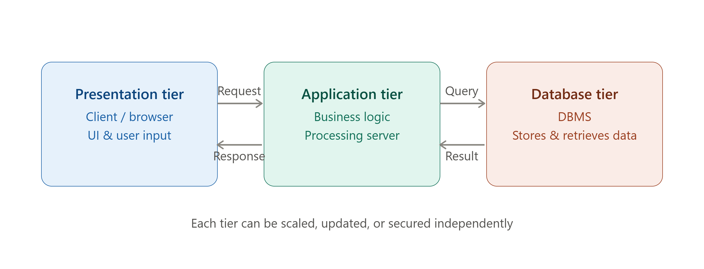

# 🏛️ Database Architecture (1-Tier, 2-Tier, 3-Tier)

> **Database Architecture** defines how the components of a database system — the user interface, application logic, and the database itself — are organized and distributed across different layers (tiers).

---

## 🎯 Why Do We Need Different Architectures?

🔴 A single small app doesn't need the same setup as a large enterprise system

🔴 Mixing business logic with the database makes systems hard to scale and maintain

🔴 Different applications have different needs for security, scalability, and performance

### Example

```text
Application Type                    | Suitable Architecture
-----------------------------------------------------------
Personal note-taking app (offline)    | 1-Tier
Simple desktop app for a small office  | 2-Tier
Large-scale web application (e.g. banking) | 3-Tier
```

---

# 🧠 The Architecture Roadmap

```text
Database Architecture
 ↓
 ├── 1-Tier Architecture   → Everything on one machine
 ├── 2-Tier Architecture     → Client + Database Server
 └── 3-Tier Architecture       → Client + Application Server + Database Server
```

---

# 1️⃣ 1-Tier Architecture

### Definition

> In a 1-Tier Architecture, the user interface, application logic, and database all reside on a **single machine** — there's no separation between layers.

### Rules

✔ Simplest possible architecture

✔ No network communication needed

✔ Used for personal, standalone applications

### Example

```text
A personal database app (e.g., Microsoft Access used locally)
where the UI, logic, and data file are all on the same computer.
```

### Visual Idea

```text
┌─────────────────────────────┐
│        Single Machine         │
│  ┌─────┐  ┌──────┐  ┌──────┐  │
│  │ UI  │→│Logic │→│  DB  │  │
│  └─────┘  └──────┘  └──────┘  │
└─────────────────────────────┘
```

### Interview Shortcut

> **1-Tier = everything (UI + logic + DB) lives on one machine. No network involved.**

---

# 2️⃣ 2-Tier Architecture

### Definition

> In a 2-Tier Architecture, the system is split into two layers — a **Client** (handles UI and application logic) that communicates **directly** with a **Database Server** over a network.

### Rules

✔ Client directly connects to the database server

✔ Application logic lives on the client side

✔ Faster than 3-tier (no middle layer) but less scalable

### Example

```text
A desktop banking application installed on each employee's
computer, where each instance connects directly to the central
database server using something like ODBC/JDBC.
```

### Visual Idea

```text
┌──────────────┐                  ┌──────────────────┐
│    Client     │ ── Direct DB ──→ │  Database Server   │
│ (UI + Logic)  │ ←── Connection ── │       (DBMS)         │
└──────────────┘                  └──────────────────┘
```

### Drawbacks

```text
✘ Business logic duplicated across every client
✘ Harder to maintain — updating logic means updating every client
✘ Less secure — clients have direct access to the database
✘ Doesn't scale well with a large number of users
```

### Interview Shortcut

> **2-Tier = Client talks directly to the Database. No middle layer.**

---

# 3️⃣ 3-Tier Architecture

### Definition

> In a 3-Tier Architecture, the system is divided into three distinct layers — **Presentation Tier** (client), **Application Tier** (business logic server), and **Database Tier** (DBMS) — each communicating only with the adjacent layer.

> 📌 _See the rendered diagram above showing the three tiers connected left to right: Presentation → Application → Database, with request/response flows between each pair._

### The Three Tiers

**🔹 Presentation Tier (Client)**
```text
✔ The user interface — browser, mobile app, desktop app
✔ Handles user input and displays results
✔ Contains no direct database connection or business logic
```

**🔹 Application Tier (Middle Tier / Business Logic Layer)**
```text
✔ Processes business rules, validation, and computation
✔ Acts as a bridge between the client and the database
✔ Often implemented using application servers (e.g., Node.js, Django, Spring)
```

**🔹 Database Tier**
```text
✔ Stores and manages all the actual data
✔ Only accessible through the Application Tier — never directly by the client
✔ Handles queries, transactions, and data integrity
```

### How It Works

```text
Client sends a Request → Application Server processes business logic
        → Application Server sends a Query → Database Server
        → Database Server returns a Result → Application Server
        → Application Server sends a Response → Client
```

### Real-World Example

```text
A web banking application:
- Presentation Tier: The website/app the customer uses
- Application Tier: The server validating login, processing transfers
- Database Tier: The actual database storing account balances
```

### Advantages

```text
✔ Improved security — clients never directly touch the database
✔ Easier maintenance — business logic is centralized in one place
✔ Better scalability — each tier can be scaled independently
✔ Supports load balancing and distributed deployment
```

### Interview Shortcut

> **3-Tier = Client ↔ Application Server ↔ Database. Each tier is independent and only talks to its neighbor.**

---

# ⚖️ 1-Tier vs 2-Tier vs 3-Tier — Full Comparison

| Feature | 1-Tier | 2-Tier | 3-Tier |
| -------- | -------- | -------- | -------- |
| Layers | 1 (all combined) | 2 (Client + DB) | 3 (Client + App Server + DB) |
| Network Required | No | Yes | Yes |
| Business Logic Location | Same machine | Client side | Application server (middle tier) |
| Scalability | Very limited | Limited | High |
| Security | Low (single machine) | Moderate (direct DB access) | High (DB hidden behind app server) |
| Maintenance | Easy (small scale only) | Harder (logic duplicated per client) | Easier (centralized logic) |
| Best Suited For | Personal/standalone apps | Small office apps | Large-scale web/enterprise apps |

---

# 📌 Quick Revision

| Tier | Components | Key Trait |
| ------ | -------------- | ----------- |
| 1-Tier | UI + Logic + DB on one machine | No network needed |
| 2-Tier | Client (UI+Logic) ↔ Database Server | Direct DB connection |
| 3-Tier | Client ↔ Application Server ↔ Database | Middle layer adds security & scalability |

---

# 🎤 Viva Questions

### What is Database Architecture?

> It defines how the components of a database system — user interface, application logic, and the database — are organized and distributed across different layers.

### What is a 1-Tier Architecture?

> An architecture where the user interface, application logic, and database all reside on a single machine, with no network communication involved.

### What is a 2-Tier Architecture?

> An architecture where the client (handling UI and business logic) communicates directly with a database server over a network, without any middle layer.

### What is a 3-Tier Architecture?

> An architecture split into three layers — Presentation Tier (client), Application Tier (business logic server), and Database Tier (DBMS) — where each layer only communicates with its adjacent layer.

### What is the main drawback of 2-Tier Architecture?

> Business logic is duplicated across every client, making maintenance harder, and clients have direct access to the database, which reduces security.

### Why is 3-Tier Architecture more secure than 2-Tier?

> Because the client never directly accesses the database — all requests pass through the Application Tier, which validates and processes them before interacting with the database.

### What role does the Application Tier play in 3-Tier Architecture?

> It acts as a bridge between the client and the database, processing business logic, validation, and computation, so the client and database never interact directly.

### Why is 3-Tier Architecture considered more scalable?

> Because each tier (Presentation, Application, Database) can be scaled independently based on demand, unlike 1-Tier or 2-Tier where everything is tightly coupled.

### Give a real-world example of 3-Tier Architecture.

> A web banking application — the website/app is the Presentation Tier, the server validating logins and transfers is the Application Tier, and the database storing account balances is the Database Tier.

### Which architecture is best suited for a large-scale enterprise web application, and why?

> 3-Tier Architecture, because it offers better security (DB is hidden behind the application server), easier maintenance (centralized business logic), and independent scalability of each tier.

---

## 🏆 One-Line Summary

```text
1-Tier  → Everything on one machine (UI + Logic + DB)

2-Tier  → Client (UI+Logic) directly connects to Database Server

3-Tier  → Client ↔ Application Server ↔ Database Server (most secure & scalable)
```

---

<p align="center">
  
</p>

---

## References

1. Korth, Silberschatz, Sudarshan — *Database System Concepts*, 6th Edition, McGraw-Hill
2. Elmasri and Navathe — *Fundamentals of Database Systems*, 5th Edition, Pearson
3. Peter Rob and Carlos Coronel — *Database Systems: Design, Implementation and Management*, 5th Edition

---

<div align="center">

### ⭐ Star this repository if it helped you learn DBMS!

</div>
