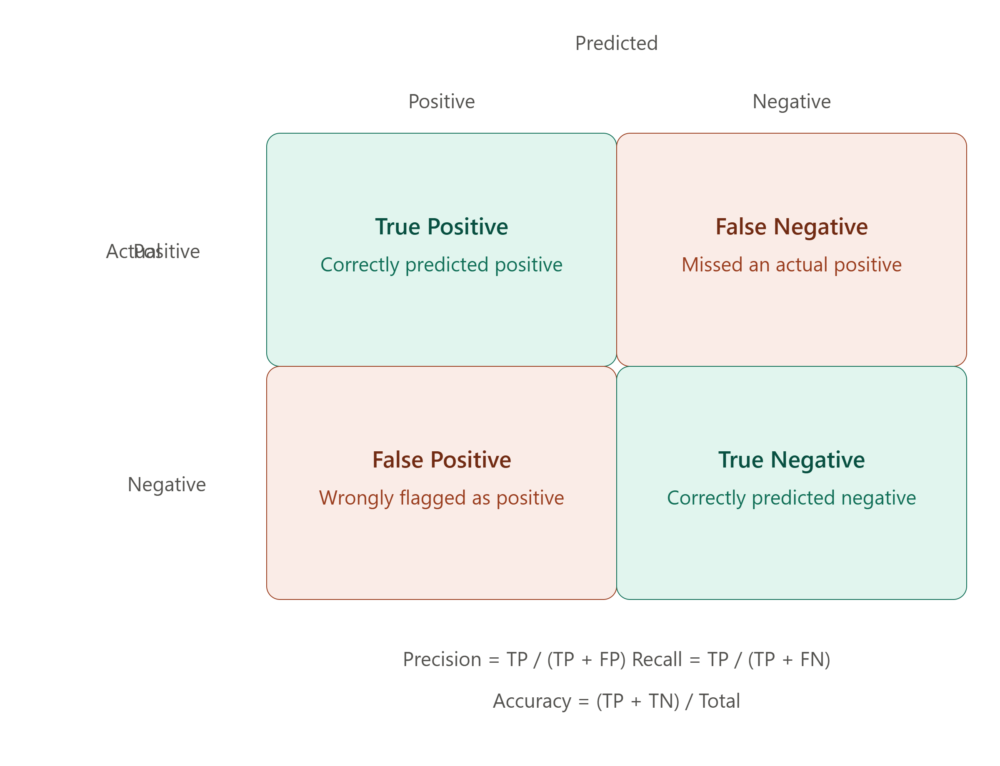

# 📐 Model Evaluation Metrics

> **Model Evaluation Metrics** are quantitative measures used to assess how well a machine learning model performs, helping decide whether it's ready for deployment or needs improvement.

---

## 🎯 Why Do We Need Evaluation Metrics?

🔴 A model with high accuracy can still be a terrible model in disguise

🔴 Different problems care about different kinds of mistakes

🔴 Without metrics, you have no objective way to compare two models

### Example

```text
Scenario                                  | Why Accuracy Alone Fails
-----------------------------------------------------------------------
Detecting a rare disease (1% of patients)  | Predicting "no disease" always gives 99% accuracy!
Spam detection                               | Missing a spam email vs. blocking a real email matter differently
Fraud detection                                | False negatives (missed fraud) are far costlier than false positives
```

---

# 🧠 The Evaluation Metrics Roadmap

```text
Model Evaluation
 ↓
 ├── Confusion Matrix     → The foundation everything else is built on
 ├── Accuracy               → Overall correctness
 ├── Precision                → How trustworthy are the positive predictions?
 ├── Recall                     → How many actual positives did we catch?
 ├── F1-Score                     → Balance between Precision and Recall
 └── ROC-AUC                         → Performance across all thresholds
```

---

# 1️⃣ The Confusion Matrix

### Definition

> A Confusion Matrix is a table that summarizes the performance of a classification model by comparing **predicted** labels against **actual** labels.

> 📌 _See the rendered diagram above showing the 2x2 confusion matrix layout with all four outcome types._

### The Four Outcomes

```text
True Positive (TP)   → Predicted Positive, Actually Positive   ✔ Correct
True Negative (TN)    → Predicted Negative, Actually Negative   ✔ Correct
False Positive (FP)     → Predicted Positive, Actually Negative   ✘ Wrong (Type I Error)
False Negative (FN)       → Predicted Negative, Actually Positive   ✘ Wrong (Type II Error)
```

### Example Table

```text
                    Predicted Positive   Predicted Negative
Actual Positive          TP = 45               FN = 5
Actual Negative           FP = 10               TN = 140
```

### Interview Shortcut

> **Confusion Matrix = TP, TN, FP, FN. Everything else (Accuracy, Precision, Recall) is calculated from these four numbers.**

---

# 2️⃣ Accuracy

### Definition

> Accuracy measures the proportion of **total predictions** that were correct — both positive and negative.

### Formula

```text
Accuracy = (TP + TN) / (TP + TN + FP + FN)
```

### Example (using the table above)

```text
Accuracy = (45 + 140) / (45 + 140 + 10 + 5)
         = 185 / 200
         = 0.925  → 92.5%
```

### When Accuracy Is Misleading

```text
Imbalanced Dataset Example:
995 negative cases, 5 positive cases

A model that always predicts "Negative" gets:
Accuracy = 995/1000 = 99.5%   ← Looks great, but catches ZERO positives!
```

### Interview Shortcut

> **Accuracy = overall correctness. Misleading on imbalanced datasets — use Precision/Recall instead.**

---

# 3️⃣ Precision

### Definition

> Precision measures, out of all the cases the model predicted as **Positive**, how many were actually Positive. It answers: "When the model says yes, can I trust it?"

### Formula

```text
Precision = TP / (TP + FP)
```

### Example

```text
Precision = 45 / (45 + 10)
          = 45 / 55
          = 0.818  → 81.8%
```

### When Precision Matters Most

```text
Spam Detection: A False Positive means a real, important
email gets marked as spam — very costly to the user.
High precision avoids flagging legitimate emails.
```

### Interview Shortcut

> **Precision = trustworthiness of positive predictions. Focuses on minimizing False Positives.**

---

# 4️⃣ Recall (Sensitivity)

### Definition

> Recall measures, out of all the **actual Positive** cases, how many the model successfully identified. It answers: "Did the model catch everything it should have?"

### Formula

```text
Recall = TP / (TP + FN)
```

### Example

```text
Recall = 45 / (45 + 5)
       = 45 / 50
       = 0.90  → 90%
```

### When Recall Matters Most

```text
Disease Detection: A False Negative means a sick patient
is told they're healthy — potentially life-threatening.
High recall avoids missing actual positive cases.
```

### Interview Shortcut

> **Recall = how many real positives were caught. Focuses on minimizing False Negatives.**

---

# 5️⃣ The Precision-Recall Tradeoff

### Definition

> Precision and Recall often move in **opposite directions** — improving one tends to worsen the other, depending on where the classification threshold is set.

### Example

```text
Lowering the threshold to classify "Positive" more easily:
✔ Recall increases (catches more actual positives)
✘ Precision decreases (also catches more false positives)

Raising the threshold to be stricter:
✔ Precision increases (fewer false positives)
✘ Recall decreases (misses more actual positives)
```

### Interview Shortcut

> **Precision vs Recall = a tradeoff. You usually can't maximize both at once.**

---

# 6️⃣ F1-Score

### Definition

> The F1-Score is the **harmonic mean** of Precision and Recall, providing a single balanced metric when both false positives and false negatives matter.

### Formula

```text
F1-Score = 2 × (Precision × Recall) / (Precision + Recall)
```

### Example

```text
Precision = 0.818, Recall = 0.90

F1-Score = 2 × (0.818 × 0.90) / (0.818 + 0.90)
         = 2 × 0.736 / 1.718
         = 0.857  → 85.7%
```

### Why Harmonic Mean (Not Average)?

```text
The harmonic mean punishes extreme imbalances more than
a simple average would — if either Precision or Recall is
very low, F1-Score drops sharply, reflecting a real weakness.
```

### Interview Shortcut

> **F1-Score = balance between Precision and Recall. Use when both false positives and false negatives matter.**

---

# 7️⃣ Specificity

### Definition

> Specificity measures, out of all the **actual Negative** cases, how many the model correctly identified as Negative.

### Formula

```text
Specificity = TN / (TN + FP)
```

### Example

```text
Specificity = 140 / (140 + 10)
            = 140 / 150
            = 0.933  → 93.3%
```

### Interview Shortcut

> **Specificity = Recall, but for the Negative class.**

---

# 8️⃣ ROC Curve & AUC

### Definition

> The **ROC Curve** (Receiver Operating Characteristic) plots the True Positive Rate (Recall) against the False Positive Rate at various classification thresholds. **AUC** (Area Under the Curve) summarizes this into a single score.

### How to Read It

```text
True Positive Rate (Recall)
   │
 1 │              ___________
   │           /‾‾
   │        /‾‾
   │     /‾‾          ← Better model (curve bows toward top-left)
   │  /‾‾
   │/‾‾    - - - - - - - - -   ← Random guessing (diagonal line)
 0 │________________________
   0                        1
        False Positive Rate
```

### AUC Score Interpretation

```text
AUC = 1.0   → Perfect model
AUC = 0.9+  → Excellent
AUC = 0.8-0.9 → Good
AUC = 0.5   → No better than random guessing
AUC < 0.5   → Worse than random (something's wrong)
```

### Interview Shortcut

> **ROC-AUC = how well the model separates classes across ALL thresholds, not just one. Higher AUC = better separation.**

---

# ⚖️ Quick Comparison — All Metrics

| Metric | Formula | Best For |
| -------- | --------- | ---------- |
| Accuracy | (TP+TN)/Total | Balanced datasets |
| Precision | TP/(TP+FP) | When False Positives are costly |
| Recall | TP/(TP+FN) | When False Negatives are costly |
| F1-Score | 2×(P×R)/(P+R) | Balance between Precision & Recall |
| Specificity | TN/(TN+FP) | Negative class performance |
| ROC-AUC | Area under ROC curve | Overall ranking ability across thresholds |

---

# 📌 Quick Revision

| Metric | Core Question It Answers |
| -------- | --------------------------- |
| Accuracy | How many predictions were correct overall? |
| Precision | Of predicted positives, how many were actually positive? |
| Recall | Of actual positives, how many did we catch? |
| F1-Score | What's the balance between Precision and Recall? |
| ROC-AUC | How well does the model separate classes across all thresholds? |

---

# 🎤 Viva Questions

### What is a Confusion Matrix?

> A table summarizing classification performance by comparing predicted labels against actual labels, broken into True Positives, True Negatives, False Positives, and False Negatives.

### Why is Accuracy sometimes a misleading metric?

> Because on imbalanced datasets, a model can achieve high accuracy simply by always predicting the majority class, while completely failing to identify the minority class.

### What is the difference between Precision and Recall?

> Precision measures how many of the predicted positives were actually correct (focuses on False Positives), while Recall measures how many actual positives were correctly identified (focuses on False Negatives).

### What is the F1-Score and why is it used?

> The F1-Score is the harmonic mean of Precision and Recall, used as a single balanced metric when both false positives and false negatives are important to minimize.

### When would you prioritize Recall over Precision?

> In scenarios like disease detection, where missing an actual positive case (False Negative) is far more costly than a false alarm (False Positive).

### When would you prioritize Precision over Recall?

> In scenarios like spam detection, where falsely flagging a legitimate item (False Positive) is more costly than missing a few actual positives.

### What does the ROC curve represent?

> It plots the True Positive Rate against the False Positive Rate at various classification thresholds, showing how well a model separates classes across all possible thresholds.

### What does an AUC score of 0.5 indicate?

> It indicates the model performs no better than random guessing at distinguishing between classes.

### Why is the F1-Score calculated using the harmonic mean instead of a simple average?

> Because the harmonic mean penalizes extreme imbalances between Precision and Recall more heavily, ensuring the F1-Score reflects a true weakness if either metric is very low.

### What is Specificity and how does it differ from Recall?

> Specificity measures how many actual negatives were correctly identified as negative (TN/(TN+FP)), while Recall measures how many actual positives were correctly identified (TP/(TP+FN)) — they're mirror metrics for the negative and positive classes respectively.

---

## 🏆 One-Line Summary

```text
Accuracy      → Overall correctness, misleading on imbalanced data

Precision     → Trustworthiness of positive predictions (minimize FP)

Recall        → Coverage of actual positives (minimize FN)

F1-Score      → Harmonic balance of Precision and Recall

ROC-AUC       → Class separation ability across all thresholds
```

---


<p align="center">
  
</p>


---

<div align="center">

### ⭐ Star this repository if it helped you learn Machine Learning!

</div>
