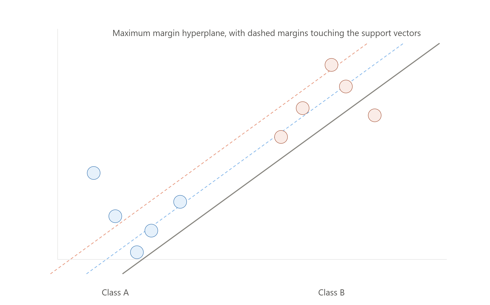

# 🛡️ Support Vector Machine (SVM)

> **Support Vector Machine** is a supervised learning algorithm that finds the **optimal boundary (hyperplane)** separating data points of different classes by maximizing the margin between them.

---

## 🎯 Why Do We Need SVM?

🔴 Many classifiers find *a* boundary, but not necessarily the *best* one

🔴 A boundary too close to the data points risks misclassifying new, unseen data

🔴 Some data isn't linearly separable in its original form — needs a smarter trick

### Example

```text
Classifier              | Finds...
-------------------------------------------------------
Logistic Regression       | A boundary that separates classes
SVM                         | The boundary that separates classes
                              AND maximizes distance to the nearest points
```

---

# 🧠 The SVM Roadmap

```text
Support Vector Machine
 ↓
 ├── Hyperplane         → The decision boundary
 ├── Margin               → Distance between hyperplane and closest points
 ├── Support Vectors        → The closest data points that define the margin
 └── Kernel Trick              → Handles non-linearly separable data
```

---

# 1️⃣ Hyperplane

### Definition

> A Hyperplane is the decision boundary that separates data points belonging to different classes. In 2D, it's a line; in 3D, it's a plane; in higher dimensions, it's a generalized "hyperplane."

### Example

```text
2D Data (2 features):  Hyperplane = a straight line
3D Data (3 features):   Hyperplane = a flat plane
N-D Data (N features):    Hyperplane = an (N-1)-dimensional surface
```

### Interview Shortcut

> **Hyperplane = the decision boundary. A line in 2D, a plane in 3D, and so on.**

---

# 2️⃣ Margin

### Definition

> The Margin is the distance between the hyperplane and the **closest data points** from each class. SVM specifically tries to find the hyperplane with the **maximum possible margin**.

> 📌 _See the rendered diagram above showing two classes of points, the solid hyperplane in the middle, and the two dashed margin lines on either side touching the nearest points._

### Why Maximize the Margin?

```text
✔ A wider margin means more "buffer space" between classes
✔ Reduces the chance of misclassifying new, unseen data points
✔ Makes the model more robust and generalizes better
```

### Types of Margin

```text
Hard Margin  → No data points are allowed inside the margin (works only for cleanly separable data)
Soft Margin   → Allows some points inside the margin or even misclassified (handles real-world, noisy data)
```

### Interview Shortcut

> **Margin = buffer zone around the hyperplane. SVM = "Maximum Margin Classifier."**

---

# 3️⃣ Support Vectors

### Definition

> Support Vectors are the data points that lie **closest** to the hyperplane — they are the critical points that actually define where the margin (and hence the hyperplane) is positioned.

### Rules

✔ Only the support vectors matter for defining the boundary

✔ Removing a non-support-vector point doesn't change the hyperplane at all

✔ Removing a support vector CAN change the hyperplane's position

### Interview Shortcut

> **Support Vectors = the closest points to the boundary. They're literally what the algorithm is named after.**

---

# 4️⃣ The Optimization Goal

### Definition

> SVM's training process is essentially solving an optimization problem: find the hyperplane that **maximizes the margin** while still correctly classifying as many points as possible.

### Simplified Goal

```text
Maximize:    Margin width
Subject to:  All points correctly classified (Hard Margin)
             OR
             Most points correctly classified, with some
             tolerance for outliers (Soft Margin)
```

### The C Parameter (Regularization)

> Controls the tradeoff between maximizing the margin and tolerating misclassifications.

```text
Large C   → Less tolerance for misclassification → narrower margin, may overfit
Small C   → More tolerance for misclassification → wider margin, may underfit
```

### Interview Shortcut

> **C parameter = tradeoff knob. Large C = strict (overfit risk). Small C = lenient (underfit risk).**

---

# 5️⃣ Linear vs Non-Linear Data

### The Problem

```text
Some datasets cannot be separated by a straight line
or flat plane — the classes are mixed in a way that
requires a curved or complex boundary.
```

### The Solution — The Kernel Trick

> The Kernel Trick **transforms data into a higher-dimensional space** where it becomes linearly separable, without actually having to compute the transformation explicitly (which would be computationally expensive).

### Visual Idea

```text
Original 2D Space (not separable by a line):
   ●  ○ ●
  ○  ● ○  ●
   ●  ○ ●

After Kernel Transformation (now separable in higher dimension):
   ●●●●●          ← Class A lifted to one "layer"
   -----  ← Hyperplane now easily separates them
   ○○○○○          ← Class B stays at another "layer"
```

### Interview Shortcut

> **Kernel Trick = projects data into higher dimensions to make it linearly separable, without expensive manual computation.**

---

# 6️⃣ Common Kernel Functions

### Linear Kernel

> Used when data is already linearly separable — no transformation needed.

```text
K(x, y) = x · y
```

### Polynomial Kernel

> Maps data into a higher-dimensional space using polynomial combinations of the original features.

```text
K(x, y) = (x · y + c)^d
```

### RBF (Radial Basis Function) / Gaussian Kernel

> The most commonly used kernel — handles complex, non-linear relationships by measuring similarity based on distance.

```text
K(x, y) = exp(-γ ||x - y||²)
```

### Interview Shortcut

> **Linear = no transformation. Polynomial = curved boundaries. RBF = most flexible, handles complex non-linear data.**

---

# ⚖️ SVM vs Logistic Regression

| Feature | SVM | Logistic Regression |
| -------- | ----- | ----------------------- |
| Goal | Maximize margin between classes | Estimate probability of class membership |
| Output | Class label (with optional probability) | Probability (0 to 1) |
| Handles Non-Linear Data | Yes (via Kernel Trick) | Not natively (needs feature engineering) |
| Sensitivity to Outliers | Lower (only support vectors matter) | Higher (all points influence the boundary) |
| Computational Cost | Higher for large datasets | Generally lower |

---

# 📌 Quick Revision

| Concept | Core Idea |
| --------- | ----------- |
| Hyperplane | The decision boundary separating classes |
| Margin | Buffer zone between hyperplane and nearest points |
| Support Vectors | Closest points that define the margin/boundary |
| Hard Margin | No tolerance for misclassification (clean data) |
| Soft Margin | Some tolerance for misclassification (noisy data) |
| C Parameter | Controls strictness vs leniency tradeoff |
| Kernel Trick | Projects data to higher dimensions for separability |

---

# 🎤 Viva Questions

### What is a Support Vector Machine?

> A supervised learning algorithm that finds the optimal hyperplane separating classes by maximizing the margin between the closest data points of each class.

### What is a Hyperplane in SVM?

> The decision boundary that separates data points of different classes — a line in 2D, a plane in 3D, and a generalized hyperplane in higher dimensions.

### What are Support Vectors?

> The data points closest to the hyperplane that define the position and orientation of the margin and decision boundary; removing them can change the hyperplane.

### What is the difference between Hard Margin and Soft Margin SVM?

> Hard Margin requires all data points to be correctly classified with no points inside the margin, suitable only for cleanly separable data. Soft Margin allows some misclassification or points within the margin, making it suitable for noisy, real-world data.

### What is the role of the C parameter in SVM?

> The C parameter controls the tradeoff between maximizing the margin and tolerating misclassification — a large C enforces stricter classification (risking overfitting), while a small C allows more tolerance (risking underfitting).

### What is the Kernel Trick and why is it used?

> The Kernel Trick transforms data into a higher-dimensional space where it becomes linearly separable, without explicitly computing the expensive transformation, allowing SVM to handle non-linearly separable data.

### Name three common kernel functions used in SVM.

> Linear Kernel, Polynomial Kernel, and RBF (Radial Basis Function) / Gaussian Kernel.

### Why is SVM generally less sensitive to outliers compared to Logistic Regression?

> Because SVM's decision boundary is determined only by the support vectors (the closest points), while Logistic Regression's boundary is influenced by all data points, making it more sensitive to outliers.

### What happens if you remove a non-support-vector data point from the training set?

> Nothing changes — the hyperplane and margin remain exactly the same, since only support vectors influence the boundary's position.

### When would you choose an RBF kernel over a Linear kernel?

> When the data is not linearly separable and exhibits complex, non-linear relationships between classes — RBF can capture such patterns, while a Linear kernel cannot.

---

## 🏆 One-Line Summary

```text
Hyperplane        → The decision boundary

Margin              → Buffer zone around the hyperplane

Support Vectors        → Closest points that define the margin

Hard Margin               → No misclassification tolerance

Soft Margin                  → Some misclassification tolerance

Kernel Trick                    → Projects data to higher dimensions for separability
```

---


<p align="center">
  
</p>


<div align="center">

### ⭐ Star this repository if it helped you learn Machine Learning!

</div>
